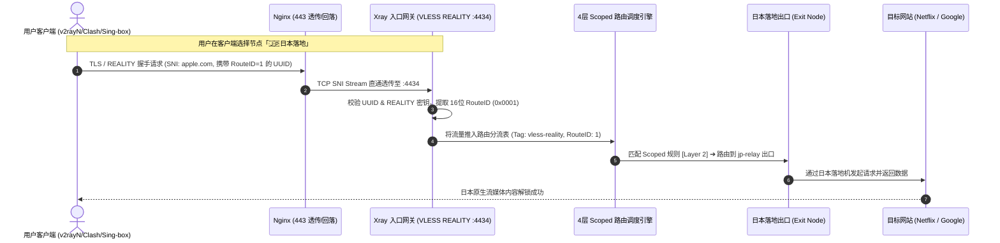
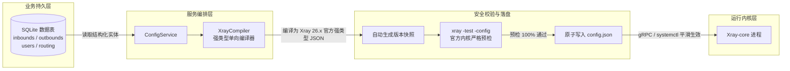

# Xray 控制面板现代化系统逻辑与架构全景图解

本文档详细拆解新版面板的**业务领域模型**、**单端口多出口分流原理**、**4 层路由编排机制**以及**编译热生效流水线**。

---

## 1. 核心业务领域三层模型 (Domain Abstraction)

系统将复杂底层的 Xray 配置解构为直观的三层业务概念：

```mermaid
graph TD
    subgraph 接入网关层 [1. 接入网关 Gateways]
        GW1["VLESS REALITY 网关 (:443)"]
        GW2["VLESS XHTTP 网关 (:4434)"]
        GW3["Trojan TLS 网关 (:8443)"]
    end

    subgraph 分流通道层 [2. 分流通道 Channels (协议级 Scoped 路由)]
        CH1["直连主通道 (Route #0 / 默认)"]
        CH2["🇯🇵 日本落地通道 (Route #1: 0x0001)"]
        CH3["🇺🇸 美国落地通道 (Route #2: 0x0002)"]
        CH4["🛡️ 广告与审计拦截通道"]
    end

    subgraph 落地出口池 [3. 落地出口 Exit Nodes]
        EX_DIRECT["direct (原生 VPS Freedom 直连)"]
        EX_WARP["warp-out (WireGuard WARP 解锁)"]
        EX_JP["jp-relay (日本落地机 VLESS/Trojan)"]
        EX_US["us-relay (美国落地机 VLESS/Trojan)"]
        EX_BLOCK["block (Blackhole 黑洞)"]
    end

    GW1 -->|默认流量| CH1 --> EX_DIRECT
    GW1 -->|UUID 携带 0x0001| CH2 --> EX_JP
    GW1 -->|UUID 携带 0x0002| CH3 --> EX_US
    GW2 -->|流媒体流量| CH2 --> EX_JP
    GW1 & GW2 & GW3 -->|广告/恶意流量| CH4 --> EX_BLOCK
```

---

## 2. 单端口多出口 (VLESS RouteID) 客户端与流量流向图

用户无需在服务器开启大量端口，通过同一个 443 端口即可享受多个不同落地国家/流媒体线路：



---

## 3. 路由表 4 层 Scoped 隔离编排机制 (Routing Layering)

新版彻底废除了以往扁平混杂的路由规则，采用自顶向下的分层保护模型：

```mermaid
flowchart TD
    InPacket([入站流量接入]) --> L1{Layer 1: 系统核心保护}

    L1 -->|inboundTag: api| ToAPI[api -> gRPC 内部管理]
    L1 -->|protocol: bittorrent / port: 25| ToBlock1[block -> 拦截 BT 与垃圾邮件]
    L1 -->|非系统流量| L2{Layer 2: 网关专属分流 Scoped Channels}

    L2 -->|inboundTag: [网关A] & vlessRoute: 1| ToJP[定向转发至 日本出口]
    L2 -->|inboundTag: [网关A] & vlessRoute: 2| ToUS[定向转发至 美国出口]
    L2 -->|inboundTag: [网关B] & vlessRoute: 1| ToWARP[定向转发至 WARP 出口]
    L2 -->|无特定通道匹配| L3{Layer 3: 全局自定义规则}

    L3 -->|geosite:category-ads-all| ToBlock2[block -> 广告拦截]
    L3 -->|geoip:cn / geosite:cn| ToDirect1[direct -> 大陆直连]
    L3 -->|自定义域名规则| ToCustom[对应出口]
    L3 -->|未匹配全局规则| L4[Layer 4: 默认兜底直连 direct]
```

---

## 4. 强类型单向编译与配置热生效流水线 (Compiler Pipeline)

从用户在 Web 面板点击按钮，到 Xray 官方内核无感平滑热加载的全过程：



---

## 总结：新架构带来的核心收益

1. **零心智负担**：普通直连用户只要创建网关即可，系统默认直连；
2. **一键进阶**：需要多出口中转时，使用「⚡ 1步向导」自动推导 RouteID 与出站参数；
3. **高稳定性**：强类型编译器 + 字段严格清洗 + 官方内核落盘前语法预检，彻底告别配置损坏与服务崩溃。
