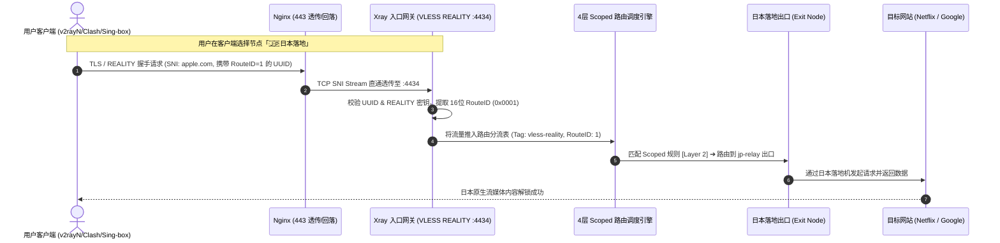

# Xray 控制面板现代化系统逻辑与架构全景图解

本文档详细拆解新版面板的**业务领域模型**、**单端口多出口分流原理**、**4 层路由编排机制**以及**编译热生效流水线**。

---

## 1. 核心业务领域三层模型 (Domain Abstraction)

系统将复杂底层的 Xray 配置解构为直观的三层业务概念：

```mermaid
graph TD
    subgraph 接入网关层 [1. 接入网关 Gateways]
        GW1["VLESS REALITY 网关 (:443)"]
        GW2["VLESS XHTTP 网关 (:4434)"]
        GW3["Trojan TLS 网关 (:8443)"]
    end

    subgraph 分流通道层 [2. 分流通道 Channels (协议级 Scoped 路由)]
        CH1["直连主通道 (Route #0 / 默认)"]
        CH2["🇯🇵 日本落地通道 (Route #1: 0x0001)"]
        CH3["🇺🇸 美国落地通道 (Route #2: 0x0002)"]
        CH4["🛡️ 广告与审计拦截通道"]
    end

    subgraph 落地出口池 [3. 落地出口 Exit Nodes]
        EX_DIRECT["direct (原生 VPS Freedom 直连)"]
        EX_WARP["warp-out (WireGuard WARP 解锁)"]
        EX_JP["jp-relay (日本落地机 VLESS/Trojan)"]
        EX_US["us-relay (美国落地机 VLESS/Trojan)"]
        EX_BLOCK["block (Blackhole 黑洞)"]
    end

    GW1 -->|默认流量| CH1 --> EX_DIRECT
    GW1 -->|UUID 携带 0x0001| CH2 --> EX_JP
    GW1 -->|UUID 携带 0x0002| CH3 --> EX_US
    GW2 -->|流媒体流量| CH2 --> EX_JP
    GW1 & GW2 & GW3 -->|广告/恶意流量| CH4 --> EX_BLOCK
```

---

## 2. 单端口多出口 (VLESS RouteID) 客户端与流量流向图

用户无需在服务器开启大量端口，通过同一个 443 端口即可享受多个不同落地国家/流媒体线路：



---

## 3. 路由表 4 层 Scoped 隔离编排机制 (Routing Layering)

新版彻底废除了以往扁平混杂的路由规则，采用自顶向下的分层保护模型：

```mermaid
flowchart TD
    InPacket([入站流量接入]) --> L1{Layer 1: 系统核心保护}

    L1 -->|inboundTag: api| ToAPI[api -> gRPC 内部管理]
    L1 -->|protocol: bittorrent / port: 25| ToBlock1[block -> 拦截 BT 与垃圾邮件]
    L1 -->|非系统流量| L2{Layer 2: 网关专属分流 Scoped Channels}

    L2 -->|inboundTag: [网关A] & vlessRoute: 1| ToJP[定向转发至 日本出口]
    L2 -->|inboundTag: [网关A] & vlessRoute: 2| ToUS[定向转发至 美国出口]
    L2 -->|inboundTag: [网关B] & vlessRoute: 1| ToWARP[定向转发至 WARP 出口]
    L2 -->|无特定通道匹配| L3{Layer 3: 全局自定义规则}

    L3 -->|geosite:category-ads-all| ToBlock2[block -> 广告拦截]
    L3 -->|geoip:cn / geosite:cn| ToDirect1[direct -> 大陆直连]
    L3 -->|自定义域名规则| ToCustom[对应出口]
    L3 -->|未匹配全局规则| L4[Layer 4: 默认兜底直连 direct]
```

---

## 4. v1.6.0 现代双轨运行时架构 (Dual-Track Architecture)

v1.6.0 实现了运行时热重载与物理落盘配置的彻底解耦，形成动静分离的双轨运行模型：

```mermaid
flowchart TD
    subgraph 动态用户状态面 [1. 动态用户运行时 (毫秒级无感热生效 / 零断网)]
        WebUser[Web 面板 / Telegram 机器人] -->|添加/删除用户| UserSvc[UserService]
        UserSvc --> XrayCoord[internal/xray 运行时协调器]
        XrayCoord -->|gRPC HandlerService<br/>AlterInbound: AddUser / RemoveUser| LiveCore[运行中 Xray-core 内核]
        XrayCoord <-->|ACID 事务提交 / 异常逆向补偿回滚| BoltDB[(嵌入式 BoltDB<br/>bbolt key-value 存储)]
    end

    subgraph 静态拓扑网关面 [2. 静态拓扑与分流规则 (结构化平滑重载)]
        WebConfig[入站网关 / 出站落地 / 路由分流 / DNS] --> ConfigSvc[ConfigService]
        ConfigSvc --> Compiler[XrayCompiler<br/>强类型单向编译器]
        Compiler --> Snap[生成版本快照]
        Snap --> Test[xray -test -config<br/>官方内核语法预检]
        Test -->|100% 预检通过| Disk[原子写入 config.json]
        Disk -->|平滑重载| LiveCore
    end

    subgraph 冷启动容灾与停机同步面 [3. 冷启动落盘容灾管道 (SyncToDiskConfig)]
        Shutdown[服务优雅停机 / 定时同步 / 手动触发] --> SyncPipe[SyncToDiskConfig]
        BoltDB -->|读取动态活跃用户集| SyncPipe
        SyncPipe -->|合并写入| Disk
        Disk -.->|冷启动极速自愈恢复| LiveCore
    end

    subgraph 实时遥测与监控面 [4. 实时流量监控 (StatsService)]
        CronJob[TrafficSyncJob 定时轮询] -->|gRPC QueryStats<br/>user>>>...>>>traffic>>>downlink| LiveCore
        CronJob --> SpeedTracker[内存差分速率计算 & 窗口防冲正]
        SpeedTracker --> SQLite[(SQLite 流量持久化)]
        SpeedTracker --> DashPush[Web 仪表盘实时渲染]
    end
```

### 4.1 运行时双向事务安全与逆向补偿回滚 (Compensating Rollback)
传统面板在修改用户时直接落盘并重启整个进程，造成所有活跃连接（TCP/TLS、WebSocket、REALITY、gRPC）瞬间断线。
v1.6.0 采用分布式两阶段保障机制：
1. **先试探下发 gRPC**：向 Xray 核心调用 `AlterInbound(AddUser/RemoveUser)`。若 gRPC 失败，则直接中断操作，不向 BoltDB 提交事务；
2. **后提交 BoltDB**：gRPC 下发成功后，在 BoltDB 写入并提交 ACID 事务；
3. **逆向补偿回滚**：若 BoltDB 写入时发生断电、磁盘满或锁异常，立即触发逆向补偿逻辑（自动调用 `RemoveUser` 撤销刚刚在 Xray 核心注入的用户），彻底杜绝内存与磁盘间的状态不一致和幽灵用户。

### 4.2 冷启动双轨落盘容灾 (`SyncToDiskConfig`)
为保障系统在突发断电、宿主机意外重启或面板未启动时 Xray 依然能够以全量用户独立运行，设计了冷启动回写容灾管道：
- 当应用接收到 `SIGTERM` / `SIGINT` 或调用冷启动同步时，`SyncToDiskConfig` 自动从 BoltDB 读取全量用户，与物理模板或现有 `config.json` 安全合并并原子落盘；
- 确保冷启动时 Xray 核心能够零延迟恢复全量用户，兼具“运行时毫秒热重载”与“冷启动强一致持久化”的双重优势。

### 4.3 多协议多态账户与聚合订阅导出 (`internal/protocol` & `internal/sub`)
- **协议标准化**：统一抽象 `protocol.Formatter` 接口，原生支持 VLESS (Vision/Reality)、VMess、Trojan、Shadowsocks 等主流协议；
- **过时字段淘汰**：彻底移除 VMess 协议已废弃且存在安全隐患的 `alterId`，强制采用 modern AEAD 架构（`alterId=0`）；
- **全平台多格式订阅导出**：`internal/sub` 模块原生支持通用 Base64、Clash / Mihomo、Sing-box 订阅配置导出与二维码分发。

### 4.4 统一服务生命周期编排 (`app.Service`)
系统通过 `errgroup.WithContext` 编排管理所有长期运行服务：
- HTTP Web API 服务（支持 Keep-Alive 连接排空优雅停机）；
- Traffic Sync 定时轮询任务；
- Telegram Bot 运维机器人；
退出阶段严格遵循有序释放依赖：**先排空 HTTP 请求并关闭外部 gRPC 客户端连接，最后释放数据库独占文件锁**，杜绝资源泄漏与数据库锁死。

---

## 5. 核心收益总结

1. **零心智负担**：普通直连用户只要创建网关即可，系统默认直连；
2. **毫秒热变更**：用户日常增删、封禁与延期秒级生效，TCP/TLS 长连接零中断；
3. **容灾强一致**：BoltDB ACID 持久化 + 自动逆向补偿 + 冷启动安全落盘双轨保障；
4. **全生态订阅**：一键聚合导出通用 Base64、Clash/Mihomo 与 Sing-box 订阅；
5. **高稳定性**：强类型单向编译器 + 字段严格清洗 + 官方内核落盘前语法预检，彻底告别配置损坏与服务崩溃。
