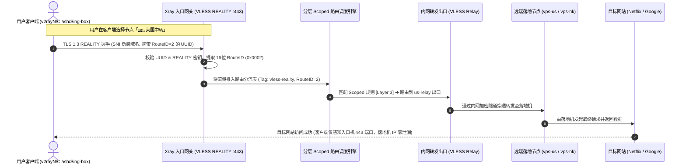

# Xray 控制面板现代化系统逻辑与架构全景图解 (v2.0.0)

本文档详细拆解新版面板的**业务领域模型**、**单端口多出口分流原理**、**分层路由编排机制**、**运行时 gRPC 动静解耦**、**带外高熵自毁分发**以及**边缘反探测网关**。

---

## 1. 核心业务领域模型 (Domain Abstraction)

系统将底层的 Xray 拓扑与分发体系解构为高内聚的业务抽象：

```mermaid
graph TD
    subgraph 接入网关层 [1. 接入网关 Gateways]
        GW1["VLESS REALITY 网关 (:443)"]
        GW2["VLESS XHTTP 网关 (:4434)"]
        GW3["Trojan TLS 网关 (:8443)"]
    end

    subgraph 分流通道层 [2. 分流通道 Channels (协议级 Scoped 路由)]
        CH1["直连主通道 (Route #0 / 默认)"]
        CH2["🇯🇵 日本落地通道 (Route #1: 0x0001)"]
        CH3["🇺🇸 美国落地通道 (Route #2: 0x0002)"]
        CH4["🛡️ 广告与审计拦截通道"]
    end

    subgraph 落地出口池 [3. 落地出口 Exit Nodes]
        EX_DIRECT["direct (原生 VPS Freedom 直连)"]
        EX_WARP["warp-out (WireGuard WARP 解锁)"]
        EX_JP["jp-relay (日本落地机 VLESS/Trojan)"]
        EX_US["us-relay (美国落地机 VLESS/Trojan)"]
        EX_BLOCK["block (Blackhole 黑洞)"]
    end

    subgraph 带外凭据分发 [4. 安全分发与边缘网关]
        TICKET["6位 Crockford Base32 提件码"]
        CF_EDGE["Cloudflare Pages 边缘网关"]
        PORTAL["15KB 原生单文件提取门户"]
    end

    GW1 -->|默认流量| CH1 --> EX_DIRECT
    GW1 -->|UUID 携带 0x0001| CH2 --> EX_JP
    GW1 -->|UUID 携带 0x0002| CH3 --> EX_US
    GW2 -->|流媒体流量| CH2 --> EX_JP
    GW1 & GW2 & GW3 -->|广告/恶意流量| CH4 --> EX_BLOCK

    TICKET --> CF_EDGE --> PORTAL -->|安全兑换| GW1
```

---

## 2. 单端口多出口 (VLESS RouteID) 客户端与流量流向图

用户无需在服务器开启大量端口，通过同一个入口机 443 端口即可享受多个不同落地国家/流媒体线路，同时 100% 隐藏后端落地机 IP：



---

## 3. 路由表分层编排机制 (Routing Layering)

系统在 `XrayCompiler` 中采用自顶向下的严格分层保护模型：

```mermaid
flowchart TD
    InPacket([入站流量接入]) --> L1{Layer 1: 系统核心与安全保护}

    L1 -->|inboundTag: api| ToAPI[api -> gRPC 内部管理 8080]
    L1 -->|protocol: bittorrent / port: 25| ToBlock1[block -> 拦截 BT 与垃圾邮件]
    L1 -->|非系统流量| L2{Layer 2: 全局与业务自定义规则}

    L2 -->|geosite:category-ads-all| ToBlock2[block -> 广告拦截]
    L2 -->|geoip:cn / geosite:cn| ToDirect1[direct -> 大陆直连]
    L2 -->|自定义域名/IP 规则| ToCustom[对应出口]
    L2 -->|未命中自定义规则| L3{Layer 3: 接入网关专属通道 Scoped Rules}

    L3 -->|inboundTag: [网关A] & vlessRoute: 1| ToJP[定向转发至 日本直连]
    L3 -->|inboundTag: [网关A] & vlessRoute: 2| ToUS[定向转发至 美国中转]
    L3 -->|无特定通道匹配| L4[Layer 4: 默认兜底直连 direct]
```

---

## 4. v2.0.0 现代解耦运行时与安全分发架构

v2.0.0 实现了控制面、数据面、持久化与边缘分发的全链路闭环解耦：

```mermaid
flowchart TD
    subgraph 边缘网关与反爬面 [1. Cloudflare Pages 边缘网关 (防探测 & 屏蔽扫描)]
        CF_Worker["_worker.js 边缘分流调度"]
        CF_Camo["/ 根路径: 中立公开站点首页 (200 OK)"]
        CF_Bot["智能爬虫识别 (微信/扫描爬虫返回 200 OK 静态页)"]
        CF_Portal["/portal: 15KB 原生单文件提取门户 (边缘 10ms 直达)"]
    end

    subgraph 动态凭据分发面 [2. 带外凭据流转与阅后即焚 (Ticket System)]
        TicketSvc["TicketService 业务用例"]
        CAS_Check["CAS 条件原子扣减 (remaining_uses - 1)"]
        AutoWipe["四维自毁: 次数归零异步物理 DELETE + 客户端内存自毁"]
    end

    subgraph 动态用户状态面 [3. 动态用户运行时 (毫秒级无感热生效 / 零断网)]
        WebUser[Web 面板 / Telegram 机器人] -->|添加/删除用户| UserSvc[UserService]
        UserSvc -->|gRPC HandlerService<br/>AddUser / RemoveUser| LiveCore[运行中 Xray-core 内核]
        UserSvc <-->|GORM 事务持久化| SQLite[(纯 Go SQLite<br/>WAL 模式 panel.db)]
    end

    subgraph 静态拓扑网关面 [4. 静态拓扑与编译容灾 (结构化平滑重载)]
        WebConfig[入站网关 / 出站落地 / 路由分流 / DNS] --> ConfigSvc[ConfigService]
        ConfigSvc --> Compiler[XrayCompiler<br/>强类型单向编译器]
        Compiler --> Snap[生成版本快照]
        Snap --> Test[xray -test -config<br/>官方内核语法预检]
        Test -->|100% 预检通过| Disk[原子写入 config.json]
        Disk -->|平滑重载| LiveCore
    end

    subgraph 实时遥测与监控面 [5. 实时流量监控 (StatsService)]
        CronJob[TrafficSyncJob 5s 周期轮询] -->|gRPC QueryTrafficStats| LiveCore
        CronJob --> SpeedTracker[内存差分速率计算 & 6s 窗口防冲正]
        SpeedTracker --> SQLite
    end

    %% 数据连接
    CF_Worker --> CF_Camo
    CF_Worker --> CF_Bot
    CF_Worker --> CF_Portal
    CF_Worker -->|POST /api/portal/claim (强制 no-store)| TicketSvc
    TicketSvc --> CAS_Check --> AutoWipe --> SQLite
```

### 4.1 纯 Go SQLite 持久化与 WAL 并发排队
* 采用 `github.com/glebarez/sqlite`，彻底消除 CGO 依赖，实现单二进制极简跨平台构建；
* 启用 `journal_mode=WAL`（Write-Ahead Logging）与 `busy_timeout=5000`，配合连接池 `MaxOpenConns=1` 串行写入，读操作并发无锁，写操作安全排队，根治了数据库死锁。

### 4.2 运行时 gRPC 零停机热重载与落盘编译
* **日常状态变更**：用户新增、停用、配额超额下线通过 Xray 原生 `HandlerServiceClient` 在毫秒级内完成，运行中长连接（TCP/TLS、WebSocket、REALITY）永不断线；
* **冷启动容灾**：动态变更后异步编译并安全合并落盘至 `config.json`。即使宿主机断电或面板离线，Xray 核心原生拉起即可恢复全量用户独立运行。

### 4.3 带外高熵凭据与四维阅后即焚机制
* **高熵码生成**：使用系统安全熵源 `crypto/rand` 和无偏位运算（`b & 0x1F`）生成 6 位 Crockford Base32 编码（10.7 亿高熵组合），微信/QQ 沟通绝不出现节点链接、UUID 或公网 IP；
* **覆写策略**：单用户同一时刻仅最新 1 个提件码有效，生成新码自动物理清理旧码；
* **四维自毁保障**：
  1. **逻辑自毁**：CAS 原子更新 `remaining_uses > 0 AND expires_at > now`，先抢占后发放；
  2. **存储自毁**：兑换次数扣减归零立即异步执行 SQLite `DELETE` 物理抹除，后台每 60 秒定期清理过期凭据；
  3. **客户端自毁**：前端记录绝对到期时间戳，锁屏休眠超时即刻清空 DOM 与内存凭据；
  4. **传输防缓存**：强制打上 `Cache-Control: no-store, no-cache, private`，禁止任何 CDN 边缘与浏览器本地缓存。

### 4.4 边缘反探测网关与多重解码穿越净化
* **智能爬虫欺骗**：Cloudflare Pages 识别微信（`MicroMessengerBot`）、腾讯及自动化安全扫描器，统一返回 200 OK 伪装健康页，维持域名的高信誉评分；
* **Fixed-point 定点多重解码**：针对 `%252e%252e` 等双重/三重 URL 编码攻击，执行最多 3 轮循环解码至收敛，强校验拒绝 `..`、`\`、`\0` 等穿越路径，确保边缘网关只放行白名单接口，VPS 源站后台完全隐蔽。

### 4.5 流量 6 秒防冲正窗口与瞬时流速清零
* **防冲正时间窗口 (`IsUserRecentlyReset`)**：管理员重置流量时打上时间戳，6 秒内主动抛弃来自 Xray 管道的在途残留增量，防止重置后的计数器被冲正回填；
* **瞬时流速精准计算**：维护内存滑动流速字典，周期内无流量新增即刻置零，消除仪表盘曲线拖尾。

### 4.6 统一服务生命周期编排 (`app.Service`)
系统通过 `errgroup.WithContext` 统一编排管理所有长期运行服务：
* HTTP Web API 服务（支持 Keep-Alive 连接排空优雅停机）；
* Traffic Sync 定时轮询任务；
* Telegram Bot 运维机器人；
退出阶段严格遵循有序释放依赖：**先排空 HTTP 请求并关闭外部 gRPC 客户端连接，最后释放数据库独占文件锁**，杜绝资源泄漏。

---

## 5. 核心收益总结

1. **零断网体验**：日常用户增删、封禁与延期毫秒级生效，存量长连接零中断；
2. **极高隐蔽性**：单端口承载多国家出口，真实落地机 IP 100% 隐藏，微信仅流转中立提件码；
3. **容灾强一致**：纯 Go SQLite WAL 事务持久化 + 冷启动自动编译安全落盘；
4. **边缘反封锁**：Cloudflare Pages 边缘网关智能欺骗扫描爬虫，路径穿越净化收敛攻击面；
5. **全生态订阅**：一键聚合导出通用 Base64、Clash/Mihomo 与 Sing-box 订阅。
