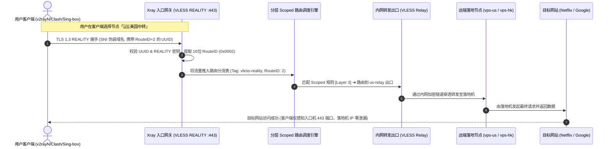

# Xray 控制面板现代化系统逻辑与架构全景图解 (v2.6.0)

本文档详细拆解新版面板的**业务领域模型**、**单端口多出口分流原理**、**分层路由编排机制**、**运行时 gRPC 动静解耦**、**带外高熵自毁分发**、**边缘反探测与多机漫游网关**，以及 v2.1 ~ v2.6 演进而来的 **SubRoute 用户隔离**、**Reality 域名合规巡检**、**Telegram Bot 运维**、**审计日志**、**GeoData 热更新**、**Alert 告警**、**多协议注册表**与**前端控制台体系**。

---

## 1. 核心业务领域模型 (Domain Abstraction)

系统将底层的 Xray 拓扑与分发体系解构为高内聚的业务抽象，核心实体收敛于 `internal/domain`，保持无外部副作用、100% 可单测：

```mermaid
graph TD
    subgraph 接入网关层 [1. 接入网关 Gateways]
        GW1["VLESS REALITY 网关 (:443)"]
        GW2["VLESS XHTTP 网关 (:4434)"]
        GW3["Trojan TLS 网关 (:8443)"]
    end

    subgraph 分流通道层 [2. 分流通道 Channels (协议级 Scoped 路由)]
        CH1["直连主通道 (Route #0 / 默认)"]
        CH2["🇯🇵 日本落地通道 (Route #1: 0x0001)"]
        CH3["🇺🇸 美国落地通道 (Route #2: 0x0002)"]
        CH4["🛡️ 广告与审计拦截通道"]
    end

    subgraph 落地出口池 [3. 落地出口 Exit Nodes]
        EX_DIRECT["direct (原生 VPS Freedom 直连)"]
        EX_WARP["warp-out (WireGuard WARP 解锁)"]
        EX_JP["jp-relay (日本落地机 VLESS/Trojan)"]
        EX_US["us-relay (美国落地机 VLESS/Trojan)"]
        EX_BLOCK["block (Blackhole 黑洞)"]
    end

    subgraph 带外凭据分发 [4. 安全分发与边缘网关]
        TICKET["6位 Crockford Base32 提件码"]
        CF_EDGE["Cloudflare Pages 边缘网关"]
        PORTAL["原生单文件提取门户"]
    end

    GW1 -->|默认流量| CH1 --> EX_DIRECT
    GW1 -->|UUID 携带 0x0001| CH2 --> EX_JP
    GW1 -->|UUID 携带 0x0002| CH3 --> EX_US
    GW2 -->|流媒体流量| CH2 --> EX_JP
    GW1 & GW2 & GW3 -->|广告/恶意流量| CH4 --> EX_BLOCK

    TICKET --> CF_EDGE --> PORTAL -->|安全兑换| GW1
```

领域实体还包含：`User`（配额、到期、活跃状态与订阅 token）、`Outbound`、`DNS`、`Ticket`、`AuditLog`、`ConfigSnapshot`、`Setting`、`TrafficLog`，以及 Reality 巡检相关的 `RealityCheckItem` / `RealitySummaryStatus`。

---

## 2. 单端口多出口 (VLESS RouteID) 客户端与流量流向图

用户无需在服务器开启大量端口，通过同一个入口机 443 端口即可享受多个不同落地国家/流媒体线路，同时 100% 隐藏后端落地机 IP：

```mermaid
sequenceDiagram
    autonumber
    actor User as 用户客户端 (v2rayN/Clash/Sing-box)
    participant Gateway as Xray 入口网关 (VLESS REALITY :443)
    participant Router as 分层 Scoped 路由调度引擎
    participant RelayOut as 内网转发出口 (VLESS Relay)
    participant EgressNode as 远端落地节点 (vps-us / vps-hk)
    participant Target as 目标网站 (Netflix / Google)

    Note over User,Gateway: 用户在客户端选择节点「🇺🇸 美国中转」
    User->>Gateway: TLS 1.3 REALITY 握手 (SNI 伪装域名, 携带 RouteID=2 的 UUID)
    Gateway->>Gateway: 校验 UUID & REALITY 密钥，提取 16位 RouteID (0x0002)
    Gateway->>Router: 将流量推入路由分流表 (Tag: vless-reality, RouteID: 2)
    Router->>RelayOut: 匹配 Scoped 规则 [Layer 3] ➔ 路由到 us-relay 出口
    RelayOut->>EgressNode: 通过内网加密隧道穿透转发至落地机
    EgressNode->>Target: 由落地机发起最终请求并返回数据
    Target-->>User: 目标网站访问成功 (客户端仅感知入口机 443 端口，落地机 IP 零泄漏)
```

---

## 3. 路由表分层编排机制 (Routing Layering)

系统在 `internal/adapter/xray/compiler.go` 的 `XrayCompiler.Compile` 中采用自顶向下的严格分层保护模型，最终生成 `Layer 1 ~ Layer 4` 的有序规则序列：

```mermaid
flowchart TD
    InPacket([入站流量接入]) --> L1{Layer 1: 系统核心与安全保护}

    L1 -->|inboundTag: api| ToAPI[api -> gRPC 内部管理 8080]
    L1 -->|protocol: bittorrent / port: 25| ToBlock1[block -> 拦截 BT 与垃圾邮件]
    L1 -->|非系统流量| L2{Layer 2: 全局与业务自定义规则}

    L2 -->|geosite:category-ads-all| ToBlock2[block -> 广告拦截]
    L2 -->|geoip:cn / geosite:cn| ToDirect1[direct -> 大陆直连]
    L2 -->|自定义域名/IP 规则| ToCustom[对应出口]
    L2 -->|未命中自定义规则| L3{Layer 3: 接入网关专属通道 Scoped Rules}

    L3 -->|inboundTag: [网关A] & vlessRoute: 1| ToJP[定向转发至 日本直连]
    L3 -->|inboundTag: [网关A] & vlessRoute: 2| ToUS[定向转发至 美国中转]
    L3 -->|Layer 3 网关规则注入 User: [email]| ToWhitelist[物理阻断非授权用户]
    L3 -->|无特定通道匹配| L4[Layer 4: 默认兜底直连 direct]
```

---

## 4. v2.6.0 现代解耦运行时与安全分发架构

系统实现了控制面、数据面、持久化与边缘分发的全链路闭环解耦：

```mermaid
flowchart TD
    subgraph 边缘网关与反爬面 [1. Cloudflare 边缘网关 (防探测 & 屏蔽扫描 & 多机漫游)]
        CF_Worker["_worker.js 边缘分流调度"]
        CF_Camo["/ 根路径: 中立公开站点首页 (200 OK)"]
        CF_Bot["智能爬虫识别 (微信/扫描爬虫返回 200 OK 静态页)"]
        CF_Portal["/portal: 原生单文件提取门户 (边缘直达)"]
        CF_Roam["多机漫游: Worker / Pages 统一凭据寻呼网关"]
    end

    subgraph 动态凭据分发面 [2. 带外凭据流转与阅后即焚 (Ticket System)]
        TicketSvc["TicketService 业务用例"]
        CAS_Check["CAS 条件原子扣减 (remaining_uses - 1)"]
        AutoWipe["四维自毁: 次数归零异步物理 DELETE + 客户端内存自毁"]
    end

    subgraph 动态用户状态面 [3. 动态用户运行时 (毫秒级无感热生效 / 零断网)]
        WebUser[Web 面板 / Telegram 机器人] -->|添加/删除用户| UserSvc[UserService]
        UserSvc -->|gRPC HandlerService<br/>AddUser / RemoveUser| LiveCore[运行中 Xray-core 内核]
        UserSvc <-->|GORM 事务持久化| SQLite[(纯 Go SQLite<br/>WAL 模式 panel.db)]
    end

    subgraph 静态拓扑网关面 [4. 静态拓扑与编译容灾 (结构化平滑重载)]
        WebConfig[入站网关 / 出站落地 / 路由分流 / DNS] --> ConfigSvc[ConfigService]
        ConfigSvc --> Compiler[XrayCompiler<br/>强类型单向编译器]
        Compiler --> Snap[生成版本快照]
        Snap --> Test[xray -test -config<br/>官方内核语法预检]
        Test -->|100% 预检通过| Disk[原子写入 config.json]
        Disk -->|平滑重载| LiveCore
    end

    subgraph 实时遥测与监控面 [5. 实时流量监控 (StatsService)]
        CronJob[TrafficSyncJob 5s 周期轮询] -->|gRPC QueryTrafficStats| LiveCore
        CronJob --> SpeedTracker[内存差分速率计算 & 6s 窗口防冲正]
        SpeedTracker --> SQLite
    end

    subgraph 主动合规巡检面 [6. REALITY 域名合规巡检]
        RealSync[RealitySyncJob 12h 周期] --> Prober[RealityProber TCP/TLS/ALPN/CDN/证书探测]
        Prober --> RealCache[读写锁缓存快照]
        RealCache --> AlertSvc[AlertService 联动 Telegram 告警]
    end

    %% 数据连接
    CF_Worker --> CF_Camo
    CF_Worker --> CF_Bot
    CF_Worker --> CF_Portal
    CF_Worker --> CF_Roam
    CF_Worker -->|POST /api/portal/claim (强制 no-store)| TicketSvc
    TicketSvc --> CAS_Check --> AutoWipe --> SQLite
```

### 4.1 纯 Go SQLite 持久化、WAL 并发排队与单事务批量落盘
* 采用 `github.com/glebarez/sqlite`，彻底消除 CGO 依赖，实现单二进制极简跨平台构建；
* 启用 `journal_mode=WAL`（Write-Ahead Logging）与 `busy_timeout=5000`，配合连接池 `MaxOpenConns=1` 串行写入，读操作并发无锁，写操作安全排队，根治了数据库死锁；
* `TrafficSyncJob` 单轮采集的众多次写入，通过 `TrafficBatchRepository.BatchSyncTraffic` 收敛为**单一原子事务**，消除逐条 fsync 延迟与锁竞争；非批量实现保留回退路径以兼容测试。

### 4.2 运行时 gRPC 零停机热重载与落盘编译
* **日常状态变更**：用户新增、停用、配额超额下线通过 Xray 原生 `HandlerServiceClient` 在毫秒级内完成，运行中长连接（TCP/TLS、WebSocket、REALITY）永不断线；
* **冷启动容灾**：动态变更后异步编译并安全合并落盘至 `config.json`。即使宿主机断电或面板离线，Xray 核心原生拉起即可恢复全量用户独立运行。
* **结构化变更**：仅在入站、出站、全局路由或 DNS 发生结构性变更时，才经由 `XrayCompiler` 全量编译、官方 `xray -test -config` 预检、生成版本快照并平滑重载。

### 4.3 带外高熵凭据与四维阅后即焚机制
* **高熵码生成**：使用系统安全熵源 `crypto/rand` 和无偏位运算（`b & 0x1F`）生成 6 位 Crockford Base32 编码（10.7 亿高熵组合），微信/QQ 沟通绝不出现节点链接、UUID 或公网 IP；
* **覆写策略**：单用户同一时刻仅最新 1 个提件码有效，生成新码自动物理清理旧码；
* **四维自毁保障**：
  1. **逻辑自毁**：CAS 原子更新 `remaining_uses > 0 AND expires_at > now`，先抢占后发放；
  2. **存储自毁**：兑换次数扣减归零立即异步执行 SQLite `DELETE` 物理抹除，后台每 60 秒定期清理过期凭据；
  3. **客户端自毁**：前端记录绝对到期时间戳，锁屏休眠超时即刻清空 DOM 与内存凭据；
  4. **传输防缓存**：强制打上 `Cache-Control: no-store, no-cache, private`，禁止任何 CDN 边缘与浏览器本地缓存。

### 4.4 边缘反探测网关与多重解码穿越净化
* **智能爬虫欺骗**：Cloudflare Pages 识别微信（`MicroMessengerBot`）、腾讯及自动化安全扫描器，统一返回 200 OK 伪装健康页，维持域名的高信誉评分；
* **Fixed-point 定点多重解码**：针对 `%252e%252e` 等双重/三重 URL 编码攻击，执行最多 3 轮循环解码至收敛，强校验拒绝 `..`、`\`、`\0` 等穿越路径，确保边缘网关只放行白名单接口，VPS 源站后台完全隐蔽。

### 4.5 流量 6 秒防冲正窗口与瞬时流速清零
* **防冲正时间窗口 (`IsUserRecentlyReset`)**：管理员重置流量时打上时间戳，6 秒内主动抛弃来自 Xray 管道的在途残留增量，防止重置后的计数器被冲正回填；
* **瞬时流速精准计算**：`domain.BatchUpdateUserRuntimeSpeeds` 维护内存滑动流速字典，单次持锁批量更新并自动淘汰过期空闲条目，周期内无流量新增即刻置零，消除仪表盘曲线拖尾与锁竞争。

### 4.6 SubRoute 用户隔离与 Layer 3 物理阻断
* **领域契约**：`domain.SubRoute` 扩展 `AllowedUsers []string`，纯方法 `CanAccess(email)` 判定授权；空数组 / 缺省表示全员开放，实现无缝向后兼容；
* **展示层过滤**：订阅生成与节点转换依据用户邮箱严格过滤分流线路，全部未命中时严格下发 0 个节点；
* **内核级强隔离**：`XrayRoutingRule` 扩展 `User` 属性，编译器在 Layer 3 接入网关专属规则中精准注入白名单，物理阻断伪造 `routeId` 的越权访问，与展示层形成双层订正。

### 4.7 REALITY 伪装域名合规性主动巡检
* **多维探测**：`internal/adapter/reality` 的 `RealityProber` 覆盖 TCP 连通性、TLS 1.3 强制握手协商、ALPN（h2/http1.1）支持度、Cloudflare 等公共 CDN 拦截特征、证书域名匹配与临期（< 7 天）预警；
* **调度与状态**：`RealitySyncJob` 每 12 小时自适应轻量轮询，`RealityMonitorService` 以读写锁缓存聚合快照（`RealitySummaryStatus`），支持面板 API 手动即时触发；
* **评估与告警**：`domain/reality_evaluator.go` 纯函数将探测原始结果裁定为 `ok / warning / error` 及标准化错误类型，异常联动 Telegram 告警并在节点视图与仪表盘呈现合规徽标。

### 4.8 多协议注册表与订阅导出策略
* **协议注册中心**：`internal/protocol/registry.go` 以 `sync.RWMutex` 保护动态多格式注册表，各协议（`vless`、`vmess`、`trojan`、`shadowsocks`、`hysteria2`、`socks`）通过 `Register` 自行注册 `SubFormatter`，`Get / FormatLink / ToClash / ToSingBox` 统一分发；
* **订阅导出器**：`internal/sub/exporter.go` 同样以动态策略注册导出格式，内置 `base64`、`raw`、`clash`（含 `clash-meta` / `mihomo` 别名）、`sing-box`，并可 `ListSupportedFormats` 枚举；
* **节点转换**：`internal/protocol/node_converter.go` 将 `domain` 实体转换为 `NodeConfig`，淘汰废弃的 `alterId` 字段，遵循现代 Xray 规范（`alterId=0` / AEAD 加密）。

### 4.9 GeoData 规则库热更新
* `GeoDataService` 面向 Xray 二进制同目录（Linux 优先 `/usr/local/share/xray`）管理 `geoip.dat` / `geosite.dat`；
* 异步下载任务带进度上报（`GeoDataProgress`，含下载速率与百分比），多镜像源回退，`.tmp` 落盘后原子 `Rename`；
* 下载完成后调用 `RestartService` 平滑重载核心，使新规则库立即生效。

### 4.10 审计日志与运维可观测
* `domain.AuditLog` 定义认证、用户、入站/分流、核心配置、系统运维等动作常量；`AuditLogService` 统一落库；
* 关键写操作（登录、用户增删改、配置应用、核心重启、日志清理等）由 Service 层注入审计记录，HTTP 中间件捕获操作者与来源 IP，形成完整可追溯链路。

### 4.11 告警体系 (Alert)
* `AlertService` 汇聚三类周期检查：流量配额超限（`CheckTrafficQuotas`）、系统负载（`CheckSystemLoad`）、证书临期（`CheckCertificates`）；
* 由 `TrafficSyncJob` 的独立维护协程每 5 分钟触发，并经 Telegram Bot 外发通知；同时承担月度流量自动重置调度（`CheckAndResetMonthlyTraffic`）。

### 4.12 统一服务生命周期编排 (`app.Service`)
系统通过 `errgroup.WithContext` 统一编排管理所有长期运行服务（`main.go` 服务清单）：

| 服务 | 说明 |
| :--- | :--- |
| Host Monitor | gopsutil 主机 CPU/内存/磁盘/网卡吞吐采集 |
| HTTP Server | RESTful API（Gin 路由、JWT 鉴权、限流中间件），支持 Keep-Alive 连接排空优雅停机 |
| Traffic Sync Job | 5s 流量轮询采集与批量落盘；内嵌 5min 告警/月度重置与 1min 票据清理协程 |
| Reality Sync Job | 12h REALITY 域名合规巡检调度 |
| Telegram Bot | 运维机器人轮询与告警推送 |

**两阶段有序释放**：所有服务退出后，先 `[Phase 1/2]` 关闭外部 Xray gRPC 客户端连接，再 `[Phase 2/2]` 释放数据库独占文件锁，杜绝资源泄漏与数据丢失。

### 4.13 Cloudflare 多机漫游网关与提取门户
* `deploy/cloudflare-pages/_worker.js` 作为统一凭据漫游寻呼网关，穿透真实客户端 IP，支持多 VPS 弹性调度与放宽多机漫游兑换限流；
* `deploy/cloudflare-pages/portal.html` 与 `deploy/standalone-portal.html` 提供原生单文件提取门户，边缘直达；
* `deploy/cloudflare-worker-sub-proxy.js` 提供订阅代理能力，配合 `gateway.test.js` 保障边缘网关逻辑。

---

## 5. 前端控制台体系 (Vue 3 Console)

前端位于 `web/`，基于 Vue 3 + Vite + Tailwind CSS 构建，采用 **Table-First + 侧边巡检/配置抽屉** 的高密度开发者控制台模式：

* **目录组织**：`views/`（页面级 SFC，复杂模块按特性就近拆分 `inbounds/`、`users/`、`outbounds/` 子目录与局部 components/composables/services）、`components/ui/`（`Button`、`Input`、`Badge`、`Drawer`、`FormField`、`SectionCard` 等通用原语）、`api/`、`utils/`；
* **巨石视图解耦**：`InboundsView.vue` 与 `UsersView.vue` 由数千行精简为清晰的事件/状态调度器，重型表单抽屉与弹窗（`InboundFormDrawer`、`UserFormDrawer`、`UserShareModal`、`UserTrafficModal`）以 `defineAsyncComponent` 异步按需加载，隔离 `qrcode.vue` 等重量库；
* **分包策略**：视图组件全面采用 ES 动态导入懒加载；`vite.config.ts` 配置 Rollup `manualChunks` 细粒度拆分（`vendor-vue`、`vendor-icons`、`vendor-qrcode`、`vendor-utils`、`vendor-libs` 与 `ui-primitives`），消除大产物告警并提升首屏性能；
* **工程质量**：开启 `noUnusedLocals` / `noUnusedParameters` / `noFallthroughCasesInSwitch` 等严格 TypeScript 检查，接入 Volar 接管模式，实现 `npm run build` 零告警门禁。

---

## 6. 核心收益总结

1. **零断网体验**：日常用户增删、封禁与延期毫秒级生效，存量长连接零中断；
2. **极高隐蔽性**：单端口承载多国家出口，真实落地机 IP 100% 隐藏，微信仅流转中立提件码；
3. **容灾强一致**：纯 Go SQLite WAL 事务持久化 + 单事务批量流量落盘 + 冷启动自动编译安全落盘；
4. **边缘反封锁**：Cloudflare Pages 边缘网关智能欺骗扫描爬虫，路径穿越净化收敛攻击面，多机漫游统一寻呼；
5. **内核级权限隔离**：SubRoute 白名单在展示层过滤与 Xray Layer 3 双重订正，物理阻断越权；
6. **主动合规监控**：Reality 域名多维巡检 + 主机指标 + 证书/配额告警，异常即时联动 Telegram；
7. **全生态订阅**：多协议注册表驱动，一键聚合导出通用 Base64、Clash/Mihomo 与 Sing-box 订阅。
