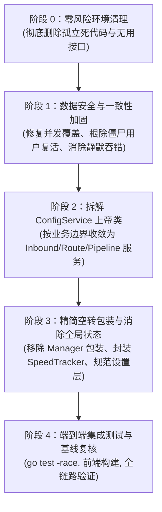

# Xray Decoupled Panel 重构实施计划 (Refactoring Implementation Plan)

> **目标**：在不破坏现有功能与稳定特性的前提下，彻底消除系统两大致命数据一致性隐患（P0：Outbound/Routing/DNS 并发覆盖、启动时从文件逆向同步导致僵尸用户复活与状态倒退），彻底清理孤立死代码（`internal/storage` 与 `internal/xray`），拆解 9 职责上帝类 `ConfigService`，消除 Domain 层包级全局状态，剔除空转包装类 `xray.Manager`，实现系统数据流清晰、真理源唯一且认知复杂度最低（KISS 原则）。

---

## 阶段规划概览



---

## User Review Required

> [!IMPORTANT]
> **1. 启动同步逻辑变更（消除僵尸用户复活）**
> 目前 `main.go` 在启动时无条件调用 `SyncFromFile`，从 `config.json` 中读取 users 和 inbounds 并无条件 Upsert 到数据库。这导致在面板删除的用户或禁用的节点，只要文件没刷新就会在下次重启时被重新创建插入数据库（僵尸用户复活）。
> **计划方案**：`SyncFromFile` 改造为**仅当 SQLite 数据库全新且为空（首次全新部署）时才执行冷初始化导入**。在已有数据时，严格以 SQLite 数据库为唯一 Source of Truth，绝不再从磁盘文件逆向 Upsert 数据。

> [!WARNING]
> **2. 物理移除孤立历史遗留包**
> `internal/storage/`（BoltDB 存储）与 `internal/xray/`（基于 BoltDB 的初代 XrayClient）完全未被任何生产代码使用。计划在阶段 0 直接物理删除，避免开发人员被同名目录和过时逻辑误导。

> [!NOTE]
> **3. 拒绝为了 Clean Architecture 引入架构膨胀物**
> 按照 `AGENTS.md` 规范：坚决不引入 `Factory`、`Provider`、无实际业务的 `UseCase` 或单实现 `Interface`。拆解 `ConfigService` 仅拆为职责明确的具体 `struct`（如 `InboundService`、`RouteService`、`PipelineService`），依赖具体类型，杜绝空转接口。

---

## 绝对不要动的内容清单 (Red Lines)

在重构全程中，以下模块经过长期实操踩坑与内核兼容验证，**严禁做任何重构或逻辑篡改**：

1. 🛑 [`internal/adapter/xray/compiler.go`](file:///home/yezisama/workspace/WorkSpace/xray-panel/internal/adapter/xray/compiler.go)：REALITY 规范化清洗（服务端清除 `serverName`、`publicKey`、`fingerprint`、`spiderX`，客户端清除复数 `serverNames` 等）、VLESS 单端口多出口 RouteID 动态计算（`ApplyVlessRouteToUUID`）、Dokodemo-Door API 入站与策略编译。
2. 🛑 [`internal/adapter/xray/config_parser.go`](file:///home/yezisama/workspace/WorkSpace/xray-panel/internal/adapter/xray/config_parser.go#L107-L161) 中的 `WriteConfig` 原子写机制：同目录 `.tmp` 写入 + `Sync()` 刷盘 + `os.Rename` 原子替换 + `.bak` 备份，这是保证 `config.json` 并发不被截断为 0 字节损坏的核心防线。
3. 🛑 [`internal/protocol/`](file:///home/yezisama/workspace/WorkSpace/xray-panel/internal/protocol/) 与 [`internal/sub/`](file:///home/yezisama/workspace/WorkSpace/xray-panel/internal/sub/) 的客户端导出策略：各协议分享链接、Clash/Mihomo 导出、Sing-box 导出的参数拼装规则。
4. 🛑 [`internal/app/service.go`](file:///home/yezisama/workspace/WorkSpace/xray-panel/internal/app/service.go) 与 [`main.go`](file:///home/yezisama/workspace/WorkSpace/xray-panel/main.go#L172-L202) 基于 `errgroup` 的服务生命周期编排：模式简洁标准，禁止引入重型依赖注入容器。
5. 🛑 [`internal/delivery/http/middleware/`](file:///home/yezisama/workspace/WorkSpace/xray-panel/internal/delivery/http/middleware/) 安全中间件：高熵 JWT 鉴权、MaxBytes 限制、防刷 IP 限流器。

---

## 实施任务分步规划

### 阶段 0：零风险环境清理 (Dead Code & Interface Pruning)

#### [DELETE] 孤立历史遗留包
- `internal/storage/bolt.go`
- `internal/storage/bolt_test.go`
- `internal/storage/codec.go`
- `internal/storage/storage.go`
- `internal/xray/client.go`
- `internal/xray/doc.go`
- `internal/xray/storage.go`
- `internal/xray/sync.go`
- `internal/xray/traffic.go`
- `internal/xray/user.go`
- `internal/xray/xray_test.go`
- `internal/xray/xray_integration_test.go`

#### [MODIFY] [`internal/adapter/xray/grpc_client.go`](file:///home/yezisama/workspace/WorkSpace/xray-panel/internal/adapter/xray/grpc_client.go)
- 清理已废弃的兼容方法：
  - 删除 `AddInboundUser(inboundTag, email, uuid, flow)`
  - 删除 `RemoveInboundUser(inboundTag, email)`
  - 删除 `QueryTraffic(pattern, reset)`

#### [MODIFY] [`internal/domain/repository.go`](file:///home/yezisama/workspace/WorkSpace/xray-panel/internal/domain/repository.go) 与 [`internal/adapter/repository/user_repo.go`](file:///home/yezisama/workspace/WorkSpace/xray-panel/internal/adapter/repository/user_repo.go)
- 从 `domain.UserRepository` 接口及实现中剔除全工程零引用的死方法：
  - 删除 `UpdateFields(ctx context.Context, id uint, values map[string]interface{}) error`
  - 删除 `ListByInboundTag(ctx context.Context, tag string) ([]User, error)`
  - 删除 `GetByUUID(ctx context.Context, uuid string) (*User, error)`

#### [MODIFY] [`internal/service/config_service.go`](file:///home/yezisama/workspace/WorkSpace/xray-panel/internal/service/config_service.go)
- 修正 `SyncUserToFile` 函数签名，消除无用的假形参：
  ```go
  // 由 SyncUserToFile(ctx, authorizedTags []string, user *domain.User, isDelete bool)
  // 改为直观真实的参数表达：
  SyncUserToFile(ctx context.Context, email string) error
  ```

---

### 阶段 1：数据安全与并发加固 (P0/P1 防线)

#### [MODIFY] [`internal/service/config_service.go`](file:///home/yezisama/workspace/WorkSpace/xray-panel/internal/service/config_service.go)
1. **解决 Outbound / Routing / DNS 并发读-改-写覆盖问题 (P0)**：
   - 在 `ConfigService` 内增加管线级互斥锁 `pipelineMu sync.Mutex`；
   - 保护 `SaveOutbound`、`DeleteOutbound`、`SaveRoutingConfig`、`SaveDNSConfig`、`SaveConfigQuietly`、`RecompileAndApply` 全过程；
   - 确保 `ReadRawConfig ➔ JSON合并 ➔ Compiler编译 ➔ WriteConfig` 处于串行原子区间内，杜绝并发请求相互覆盖抹除规则。
2. **解决启动时“僵尸用户复活”与“节点倒退”问题 (P0)**：
   - 重构 `SyncFromFile(ctx context.Context) error`：
     ```go
     func (s *ConfigService) SyncFromFile(ctx context.Context) error {
         // 检查 DB 中是否已有入站节点或用户
         inbounds, _ := s.inboundRepo.ListAll(ctx)
         users, _ := s.userRepo.ListAll(ctx)
         if len(inbounds) > 0 || len(users) > 0 {
             // 数据库已有数据，严格以 SQLite 为 Source of Truth，禁止逆向覆盖
             return nil
         }
         // 仅当数据库完全为空（全新部署首次启动）时，才从 config.json 恢复初始配置
         raw, err := s.configMgr.ReadRawConfig()
         if err != nil || len(raw) == 0 {
             return nil
         }
         return s.syncFromRawJSON(ctx, raw)
     }
     ```

#### [MODIFY] [`internal/service/user_service.go`](file:///home/yezisama/workspace/WorkSpace/xray-panel/internal/service/user_service.go)
1. **消除同步错误静默吞掉隐患 (P1)**：
   - 针对 `CreateUser`、`UpdateUser`、`DeleteUser`、`ResetSubToken`：
   - 捕获 `xrayManager.AddUser` 和 `xrayManager.RemoveUser` 的 error；
   - 捕获 `configSvc.SyncUserToFile` 的 error；
   - 记录结构化错误日志 `slog.ErrorContext(...)`，并在 gRPC 与文件均写入失败时进行错误透传或状态回滚，避免向前端伪报成功导致连接不可用。

---

### 阶段 2：拆解 `ConfigService` 上帝类 (Decoupling)

#### [NEW] [`internal/service/inbound_service.go`](file:///home/yezisama/workspace/WorkSpace/xray-panel/internal/service/inbound_service.go)
- 提取 Inbound 业务管理：
  - `ListInbounds(ctx)`（包含 `probeInboundPort` 延迟检测）
  - `CreateInbound(ctx, inbound)`
  - `UpdateInbound(ctx, inbound)`
  - `DeleteInbound(ctx, id)`
  - 依赖：`inboundRepo` 与 `PipelineService`。

#### [NEW] [`internal/service/route_service.go`](file:///home/yezisama/workspace/WorkSpace/xray-panel/internal/service/route_service.go)
- 提取出站、路由、DNS 管理：
  - `ListOutbounds`, `SaveOutbound`, `DeleteOutbound`
  - `GetRoutingConfig`, `SaveRoutingConfig`
  - `GetDNSConfig`, `SaveDNSConfig`
  - 依赖：`configMgr` 与 `PipelineService`。

#### [NEW] [`internal/service/pipeline_service.go`](file:///home/yezisama/workspace/WorkSpace/xray-panel/internal/service/pipeline_service.go)
- 专职负责核心编译落盘流水线：
  - `SaveConfigQuietly(ctx, remark)`
  - `RecompileAndApply(ctx, remark)`
  - `GetRawConfig`, `ValidateRawConfig`, `SaveAndApplyRawConfig`
  - 快照管理：`ListSnapshots`, `RollbackSnapshot`
  - 内部持有 `pipelineMu sync.Mutex` 保护全流程串行化。

#### [MODIFY] [`internal/adapter/xray/config_parser.go`](file:///home/yezisama/workspace/WorkSpace/xray-panel/internal/adapter/xray/config_parser.go)
- 将混杂在 `config_parser.go` 中的客户端订阅转换函数抽离到 `internal/service/node_converter.go`（或 `internal/sub/`）：
  - `InboundToNodeConfig`
  - `InboundsToNodeConfigs`
  - `BuildShareLink`
  - `BuildShareLinksForInbound`
  - `ApplyVlessRouteToUUID`
- 使 `ConfigManager` 恢复纯粹职责：只负责物理 `config.json` 的原子写、读取、语法校验与日志路径提取。

#### [MODIFY] [`internal/delivery/http/`](file:///home/yezisama/workspace/WorkSpace/xray-panel/internal/delivery/http/)
- `InboundHandler` 注入 `InboundService`；
- `OutboundHandler` 注入 `RouteService`；
- `RoutingHandler` 注入 `RouteService`；
- `DNSHandler` 注入 `RouteService`；
- `ConfigHandler` 注入 `PipelineService`。

---

### 阶段 3：精简包装中继与收敛状态 (Simplification)

#### [MODIFY] [`internal/domain/user_speed.go`](file:///home/yezisama/workspace/WorkSpace/xray-panel/internal/domain/user_speed.go) 与 [`internal/service/speed_tracker.go`](file:///home/yezisama/workspace/WorkSpace/xray-panel/internal/service/speed_tracker.go)
- 将 Domain 层中的包级全局可变变量：
  ```go
  var (
      speedTrackerMu sync.RWMutex
      speedTracker   = make(map[string]*UserSpeedRecord)
      userResetTimes = make(map[string]int64)
  )
  ```
- 封装为具名结构体 `type SpeedTracker struct { ... }`，作为具体实例注入到 `TrafficSyncJob` 与 `UserService` 中；
- 彻底消除 Domain 层的全局状态污染，支持安全并发与隔离单测。

#### [MODIFY] [`internal/adapter/xray/manager.go`](file:///home/yezisama/workspace/WorkSpace/xray-panel/internal/adapter/xray/manager.go)
- 废弃/内联空转包装结构体 `Manager`；
- 调用方直接依赖具体的 `*GRPCClient` 与 `*SystemdSupervisor`，不再保留一层毫无业务逻辑的单行中继包装。

#### [NEW] [`internal/service/setting_service.go`](file:///home/yezisama/workspace/WorkSpace/xray-panel/internal/service/setting_service.go) & [MODIFY] [`internal/delivery/http/handler_setting.go`](file:///home/yezisama/workspace/WorkSpace/xray-panel/internal/delivery/http/handler_setting.go)
- 将 `SettingHandler` 中越权直调 `settingRepo`、`botAdapter.UpdateConfig`、`configMgr.UpdateConfig`、`supervisor.UpdateConfig` 的分散逻辑，收敛进 `SettingService`；
- 让 HTTP Handler 只处理参数解析与 HTTP 状态码映射。

---

## 验证与测试计划 (Verification Plan)

### 1. 自动化测试 (Automated Tests)
每完成一个阶段均必须全量运行：
```bash
# 常规单元测试与缓存校验
go test ./...

# 竞态并发检测 (重点覆盖 TrafficSyncJob 与 Pipeline 编译互斥)
go test -race ./...

# 针对各核心服务的专项单元测试
go test -v ./internal/service/...
go test -v ./internal/adapter/xray/...
go test -v ./internal/delivery/...
```

### 2. 前端集成与构建验证
```bash
cd web
npm run build
cd ..
go build .
```
确认嵌入式前端资源编译打包正常，Go 二进制文件大小与符号正常。

### 3. 手工场景验证 (Manual Verification Checklist)
1. **并发 Outbound/Routing 修改测试**：通过并发脚本同时调用修改 Outbound 和修改 Routing 接口，检查 `config.json` 是否两者的修改均完整保留，确认互斥锁有效，无配置覆盖。
2. **冷启动与用户删除测试**：在面板中删除一个用户，物理重启面板进程，检查 SQLite 数据库中该用户是否保持删除状态，确认 `SyncFromFile` 没有逆向复活已删除用户。
3. **节点热加载测试**：添加新入站节点，观察 Xray 进程日志与连接状态，验证平滑 Reload 生效。
4. **订阅解析测试**：通过 `/sub/:token` 拉取全量订阅节点，在客户端（Clash Verge / v2rayN）中验证节点解析与测速正常。
