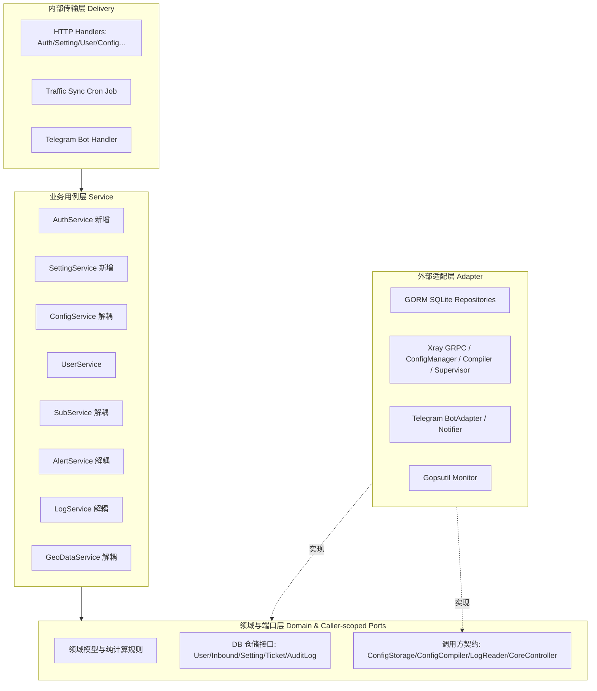

# Spec: 架构分层解耦与清晰度重构 - 技术契约

- **关联 Intent**: arch-domain-decoupling
- **主导设计人**: Dev
- **当前状态**: In-Review

---

## 1. 架构流向与设计方案

### 1.1 现状分层违规与耦合诊断
经过只读代码库深度扫描，发现核心依赖倒置问题主要集中在服务层对适配器层的反向穿透以及传输层过重：
1. **Service -> Adapter 反向依赖**：
   - `internal/service/geodata_service.go` 直接依赖 `*xray.Manager` 具体类型（仅使用 `GetVersion` 与 `RestartService`）。
   - `internal/service/alert_service.go` 直接依赖 `*xray.ConfigManager` 具体类型（仅调用 `GetCertificatePaths`）并直接调用 `xray.ParseCertFile`。
   - `internal/service/log_service.go` 直接依赖 `*xray.ConfigManager`，且响应 DTO 与方法入参直接暴露 `xray.AccessLogEntry`、`xray.ErrorLogEntry`、`xray.LogFilter`。
   - `internal/service/config_service.go` 直接依赖 `*xray.ConfigManager` 与 `*xray.XrayCompiler` 具体类型。
   - `internal/service/sub_service.go` 依赖 `adapter/xray` 中的 `InboundsToNodeConfigs` 与 `BuildShareLink`，而这二者实际是协议/节点视图转换逻辑。
2. **Delivery 层业务下沉缺失 Service 抽象**：
   - `internal/delivery/http/handler_auth.go` 直接依赖 `domain.AdminRepository` 处理登录、密码哈希比对、TOTP 校验与 JWT 签发，缺乏 `AuthService`。
   - `internal/delivery/http/handler_setting.go` 直接装配 `domain.SettingRepository`、`telegram.BotAdapter`、`xray.ConfigManager`、`xray.SystemdSupervisor` 并在 Handler 内部执行多组件联动热更新，缺乏 `SettingService`。
   - `internal/delivery/http/handler_inbound.go` 直接调用 `xray.GenerateRealityKeyPair()` 工具函数。
3. **遗留冗余与死代码**：
   - `adapter/xray/grpc_client.go`: `buildAccountMessage` 为无用别名。
   - `adapter/xray/config_parser.go`: `BuildShareLinksForInbound` 在生产代码中无任何引用（`sub_service.go` 另行内联实现）。
   - `adapter/xray/log_reader.go`: `ReadLastLines` 在生产代码中无任何引用（仅用于单元测试）。

### 1.2 重构后架构数据流向


---

## 2. API 与数据契约设计

### 2.1 新增/重构服务契约 (Caller-scoped Interfaces)

#### 1. ConfigService 接口解耦
```go
// 消除 ConfigService 对 *xray.ConfigManager 和 *xray.XrayCompiler 的硬依赖
type ConfigStorage interface {
    ReadRawConfig() ([]byte, error)
    WriteConfig(ctx context.Context, rawJSON []byte) error
    ValidateConfig(ctx context.Context, rawJSON []byte) error
}

type ConfigCompiler interface {
    CompileToJSON(inbounds []domain.Inbound, outbounds []domain.Outbound, routing *domain.RoutingConfig, dns *domain.DNSConfig, users []domain.User) ([]byte, error)
}
```

#### 2. GeoDataService 接口解耦
```go
// 消除对 *xray.Manager 强依赖
type CoreController interface {
    GetVersion(ctx context.Context) (string, error)
    RestartService(ctx context.Context) error
}
```

#### 3. LogService 数据结构与接口收敛
```go
// 日志过滤与条目类型收敛为领域/通用结构，解除与 xray 适配器的强耦合
type LogReader interface {
    GetLogPaths() (accessLog, errorLog string)
    ReadLastLinesFiltered(filePath string, maxLines int, filter domain.LogFilter) ([]string, error)
}
```

#### 4. 新增 AuthService 契约
```go
type AuthService struct {
    adminRepo domain.AdminRepository
    jwtSecret string
    auditSvc  *AuditLogService
}

func (s *AuthService) Login(ctx context.Context, username, password, passcode, clientIP string) (*LoginResult, error)
func (s *AuthService) ChangePassword(ctx context.Context, username, oldPassword, newPassword string) error
func (s *AuthService) Setup2FA(ctx context.Context, username string) (secret, qrURL string, err error)
func (s *AuthService) Confirm2FA(ctx context.Context, username, code string) error
func (s *AuthService) Disable2FA(ctx context.Context, username, code string) error
```

#### 5. 新增 SettingService 契约
```go
type SettingReloader interface {
    UpdateConfig(configPath, binPath string)
}

type SupervisorReloader interface {
    UpdateConfig(serviceName, binPath string)
}

type BotReloader interface {
    UpdateBotConfig(token string, adminChatID int64)
}

type SettingService struct {
    settingRepo domain.SettingRepository
    configMgr   SettingReloader
    supervisor  SupervisorReloader
    botAdapter  BotReloader
    auditSvc    *AuditLogService
}

func (s *SettingService) GetAllSettings(ctx context.Context) (map[string]string, error)
func (s *SettingService) UpdateSettings(ctx context.Context, settings map[string]interface{}) error
```

#### 6. 订阅与节点转换逻辑迁移
- 将 `InboundToNodeConfig`、`InboundsToNodeConfigs`、`BuildShareLink` 从 `internal/adapter/xray/config_parser.go` 移动至 `internal/protocol` 或 `internal/sub`，保持 `sub_service` 仅依赖 `domain`、`protocol` 与 `sub`，完全切断其对 `adapter/xray` 的 import。

### 2.2 外部 HTTP API 契约保持
- 所有现存 REST API 端点（路径、HTTP Method、入参、出参 JSON Key、HTTP 状态码）保持 100% 字节级一致，对外黑盒行为零感知变更。

---

## 3. 可测性设计 (Design for Testability)

* **独立纯函数计算核**:
  - `domain.CalculateSpeedDelta`: 速率与增量计算纯函数（已包含除零防护）。
  - `protocol.FormatLink`: 单纯基于节点配置对象的链接格式化。
  - `xray.ParseAccessLogLine` / `ParseErrorLogLine`: 纯字符串解析器。
* **外部依赖与 Mock 策略**:
  - 服务层全面基于 Caller-scoped 接口依赖，单元测试可直接传入轻量 Mock/Stub，无需依赖本地临时文件、真实 Xray 进程或 SQLite 数据库。

---

## 4. 替代方案与权衡考量 (Alternatives Considered & Trade-offs)

* **评估过的替代方案 1: 全局 Interface 大包 (Shared interfaces in domain/repository.go)**:
  - 将所有新接口一股脑追加进 `domain/repository.go`。
  - *未采纳原因*: 违反 ISP（接口隔离原则），且将 `ConfigCompiler` 等具体应用编排概念污染进纯领域层。Go 惯用法提倡消费方定义小接口（Caller-scoped interfaces）。
* **评估过的替代方案 2: 大爆炸重构，合并 adapter/xray 与 service**:
  - *未采纳原因*: 破坏关注点分离，扩大测试回归范围，违反 KISS 与分批交付原则。

---

## 5. 动态风险核验与回滚预案 (Risk & Rollback Verification)

* [x] **Affected Files**: 涉及 `internal/service/`、`internal/delivery/http/`、`internal/adapter/xray/` 约 8~12 个文件，属于分层内部清理，边界清晰。
* [x] **Public API & Protocol**: 严格保持 100% 向后兼容，路由与 JSON Schema 零变动。
* [x] **Data Schema**: 零改动，数据库表结构、GORM 模型与迁移零变更。
* [x] **Auth & Security**: 逻辑平移至 `AuthService`，bcrypt / TOTP / JWT 校验算法与安全边界零降级。
* [x] **Dependencies**: 零新第三方外部依赖引入，纯 Go 标准库与接口重组。
* [x] **Rollback Difficulty**: 极低，纯内部 Go 代码重构，可通过 Git revert 一键瞬时无损回滚。
* [x] **Blast Radius**: 核心计算与转发逻辑不变，全量由 `go test -race ./...` 严密守护。
* **Change Tier 结论**: 维持 **Tier 2**。
* **回滚与故障应急策略**:
  - 若在任何阶段出现 `go test -race ./...` 失败或接口不匹配，直接 git checkout 对应文件或 git revert 提交，无数据库变更与持久化状态污染。

---

## 6. 阶段准出签批 (Gate 2 Sign-off)
- [ ] 架构流向与 API 契约已冻结
- [ ] 替代方案已完成推演与权衡
- [ ] 7 维风险已核验且具备明确回滚预案
- **审查结论**: Pending
- **签批人 / 日期**: [待人类签批] / 2026-09-20 12:28
