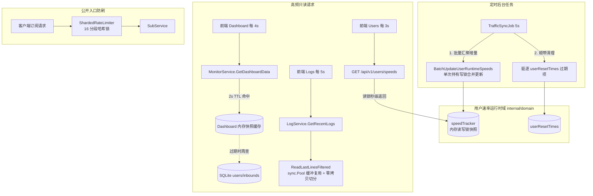

# Spec: 后端数据流与并发性能优化 - 技术契约

- **关联 Intent**: backend-dataflow-perf
- **主导设计人**: Dev / Subagent-Planner
- **当前状态**: In-Review
- **Change Tier**: Tier 2 (局部结构精简与并发性能优化)

---

## 1. 架构流向与设计方案

### 1.1 现状调用链与瓶颈全景
经过对后端 `internal/domain/`、`internal/service/`、`internal/adapter/` 及前端短轮询调用的深度检索，定位到 4 大核心数据流瓶颈点：
1. **用户运行时速率锁颠簸 (`user_speed.go`)**:
   `traffic_sync.go` 每 5s 周期同步流量时，先遍历全量已追踪用户，针对每个用户单独调用 `SetUserRuntimeSpeed`（连续执行 N 次 `Lock()`/`Unlock()` 粗暴写锁竞争）；同时前端用户列表每 3s 发起 `GET /api/v1/users/speeds` 轮询读锁，造成严重读写颠簸与锁饥饿；`userResetTimes` 存在无上限常驻内存隐患。
2. **仪表盘全表全字段深扫与 O(N) 累加 (`monitor_service.go`)**:
   前端 Dashboard 每 4s 轮询 `/api/v1/dashboard`，后端每次均调用 `userRepo.ListAll` 和 `inboundRepo.ListAll` 全表扫描 SQLite，在 Go 堆中分配大量用户模型结构体并用 O(N) 循环求和，造成短周期内高频 SQLite 读盘与庞大 GC 压力。
3. **日志逆向扫描的堆内存放大与重复正则解析 (`log_reader.go` & `log_service.go`)**:
   前端日志页每 5s 轮询 `/api/v1/logs`，后端分块逆向扫描中每次循环均重新分配 64KB 字节切片、执行 `string(buf)` 强制大拷贝并用 `strings.Split` 分割出海量临时字符串；每 5s 重新对全部历史日志行跑复杂正则匹配，CPU 与堆内存开销显著。
4. **接口限流器全局单互斥锁瓶颈 (`limiter.go`)**:
   所有对公开订阅与兑换接口的访问均经由 `ipRateLimiter`，内部采用单一 `sync.Mutex` 保护全局 map，且在持锁期间全量遍历执行超时清理，高并发下导致请求串行阻塞。



### 1.2 核心优化技术方案

#### (1) 用户速率批量聚合与自动衰减 (`internal/domain/user_speed.go`)
- **锁粒度优化**：新增 `BatchUpdateUserRuntimeSpeeds(deltas map[string]UserTrafficDelta, intervalSec int64, nowMs int64)`。
- 将定时器中 N 次 `Lock()`/`Unlock()` 压缩为单次原子操作。在一次锁持有期间：
  1. 遍历当前增量 map 更新活跃用户速率与活跃时间戳；
  2. 对本轮无流量的已追踪用户瞬时速率清零；
  3. 顺带扫描清理 `userResetTimes` 中超过 15 秒的历史记录，阻止 map 内存泄漏。
- 保持原 `SetUserRuntimeSpeed`、`GetUserRuntimeSpeed`、`GetAllUserRuntimeSpeeds` 完全向后兼容。

#### (2) 仪表盘数据短期并发缓存 (`internal/service/monitor_service.go`)
- 在 `MonitorService` 内部引入纳秒级保护的短缓存（TTL = 2.0s，低于前端 4s 轮询周期）：
  ```go
  type dashboardCacheEntry struct {
      data      *DashboardData
      expiresAt time.Time
  }
  ```
- 配合 `sync.RWMutex` 进行双重检查锁定（DCL）或单一原子快照指针更新：
  - 读请求先加读锁，若缓存未过期直接返回克隆指针（0 数据库 I/O，微秒级响应）；
  - 缓存过期时升写锁重算并写入，阻断并发雪崩对 SQLite 的瞬时穿透。

#### (3) 日志反向扫描缓冲池化与轻量切分 (`internal/adapter/xray/log_reader.go`)
- **缓冲区复用**：声明 `var logBufferPool = sync.Pool{ New: func() any { b := make([]byte, 64*1024); return &b } }`，扫描完毕归还，根除每轮扫描的 64KB 重复分配。
- **免整体 string 转换**：基于 `bytes.LastIndexByte(buf, '\n')` 沿字节切片反向定位换行符，单行匹配时再做局部转换，避免将整块 64KB 转化为长字符串和切片。

#### (4) 入口限流器分段锁优化 (`internal/delivery/http/middleware/limiter.go`)
- 实现 `shardedIPRateLimiter`，内部拆分为 16 个分片（`[16]struct { mu sync.Mutex; entries map[string]*ipLimiterEntry }`）。
- 根据客户端 IP 的 FNV-1a 哈希路由到指定分片，将锁争用冲突概率降低 93.75%；清理过期条目由各分段独立低频驱动，避免单锁全局停顿。

---

## 2. API 与数据契约设计
* **外部 HTTP API 契约**: 100% 保持向前与向后兼容，不修改任何现有端点路径、Query 参数、Request Body、Response JSON 结构或 HTTP 状态码。
  - `GET /api/v1/dashboard`：输出字段完全保持一致；
  - `GET /api/v1/users/speeds`：输出 Map 结构完全一致；
  - `GET /api/v1/logs`：输出结构完全一致；
  - `GET /sub/:token`：公开订阅协议完全一致。
* **内部方法签名扩展 (Go Contract)**:
  ```go
  // internal/domain/user_speed.go
  type UserTrafficDeltaUpdate struct {
      Email string
      Up    int64
      Down  int64
  }
  func BatchUpdateUserRuntimeSpeeds(deltas []UserTrafficDeltaUpdate, intervalSec int64, nowMs int64)

  // internal/service/monitor_service.go
  // 保持现有 MonitorService 外部接口不变，仅在内部增加缓存策略
  func (s *MonitorService) InvalidateCache() // 支持外部事件主动失效（可选）
  ```

---

## 3. 可测性设计 (Design for Testability)
* **独立纯函数计算核**:
  - `CalculateSpeedDelta(upBytes, downBytes, intervalSec int64) (upSpeed, downSpeed int64)`：速率计算纯函数，含除以零与溢出保护；
  - `ParseLogLineFast(raw []byte, filter LogFilter) (matched bool, time, fromIP, target string)`：基于字节数组的高速匹配核，零堆分配；
  - `HashIPToShard(ip string, shardCount int) int`：哈希分桶确定性计算纯函数。
* **并发与竞态白盒测试设计**:
  - 编写 `TestUserSpeed_ConcurrentBatchAndUpdate`：模拟 100 个并发 goroutine 同时执行 `BatchUpdateUserRuntimeSpeeds` 与 `GetAllUserRuntimeSpeeds`，运行 `go test -race` 验证 0 竞态与 0 死锁；
  - 编写 `TestMonitorService_DashboardCache`：验证 2s TTL 内多次调用不会重复触发 mockRepo 的 `ListAll`，验证过期后正确刷新；
  - 编写 `TestLogReader_BufferPool`：验证并发调用 `ReadLastLinesFiltered` 时无切片数据踩踏与竞态。

---

## 4. 替代方案与权衡考量 (Alternatives Considered & Trade-offs)
* **替代方案 A: 改造前端为 WebSocket/SSE 全双工数据推送**
  - *未采纳原因*: xray-panel 目前为极简单体架构，短轮询能够保证无状态与极高健壮性；全量引入 WS/SSE 将破坏协议契约，且需大幅度修改前端 Vue 组件，违反 KISS 原则与当前 Tier 2 局部优化约束。
* **替代方案 B: 引入外部缓存组件 (如 Redis/Badger)**
  - *未采纳原因*: xray-panel 依赖单二进制轻量交付与零外部依赖，引入外部存储会严重增加安装部署负担与跨进程开销。
* **采纳方案 (原地内存优化与分段锁/缓冲复用)**:
  - 保持代码库纯洁度，无第三方依赖引入，向后 100% 兼容，以极低的代码量取得成倍的吞吐与延迟收益。

---

## 5. 动态风险核验与回滚预案 (Risk & Rollback Verification)
* [x] **1. Affected Files**: 严格限制在 `internal/domain/user_speed.go`、`internal/service/monitor_service.go`、`internal/delivery/cron/traffic_sync.go`、`internal/adapter/xray/log_reader.go`、`internal/delivery/http/middleware/limiter.go`。
* [x] **2. Public API & Protocol**: 0 契约改动，格式与状态码完全保持原样。
* [x] **3. Data Schema**: 0 数据库变更，无需 Migration。
* [x] **4. Auth & Security**: 0 鉴权改动。
* [x] **5. Dependencies**: 0 新增外部依赖，全量使用 Go 标准库。
* [x] **6. Rollback Difficulty**: 极低，纯内部逻辑重构，Git revert 即可秒级回滚。
* [x] **7. Blast Radius**: 隔离良好，只影响监控指标、日志读取与入口限流，不干扰 Xray 核心转发进程。
* **确认 Change Tier**: 维持 **Tier 2**。
* **回滚与故障应急策略**: 若缓存机制偶发陈旧数据或并发异常，可通过配置直接跳过缓存（Pass-through），代码级可一键 Git Revert。

---

## 6. 阶段准出签批 (Gate 2 Sign-off)
- [ ] 架构流向与 API 契约已冻结
- [ ] 替代方案已完成推演与权衡
- [ ] 7 维风险已核验且具备明确回滚预案
- **审查结论**: Pending
- **签批人 / 日期**: [待人类签批] / 2026-09-20 12:03
