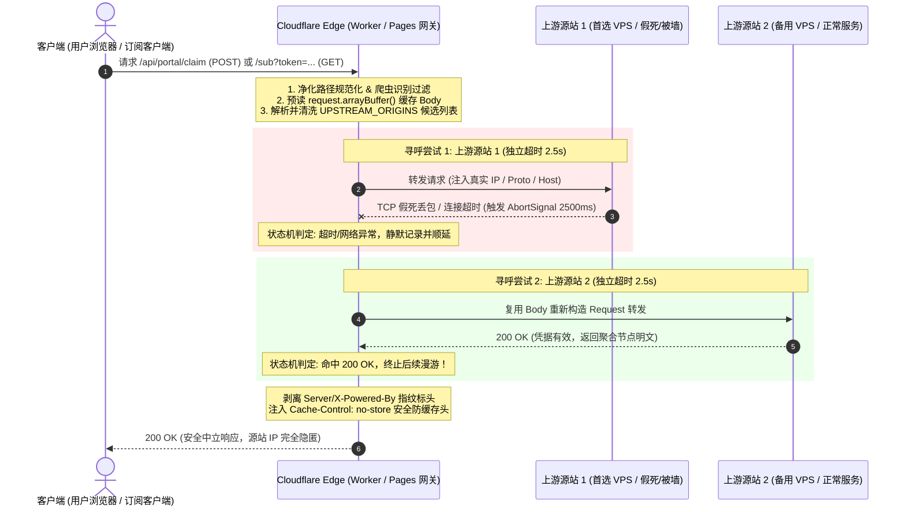
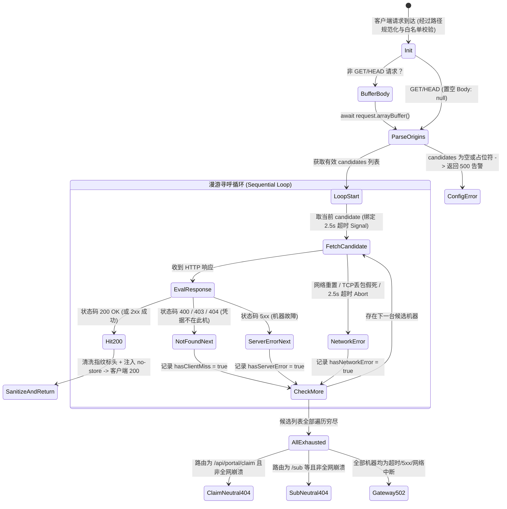

# Spec: Cloudflare 多 VPS 弹性调度与顺序漫游网关 - 技术契约

- **关联 Intent**: cf-multi-upstream-gateway
- **主导设计人**: Subagent Planner
- **当前状态**: In-Review
- **Change Tier**: Tier 2 (单模块特性演进)

---

## 1. 架构流向与设计方案

本方案为 Cloudflare Worker / Pages 反探测网关引入**顺序漫游寻呼机制 (Sequential Roaming)**，解决单 VPS 源站被墙单点故障、裸备机暴露公网高危风险、POST 请求体单次消费无法跨机重试以及阻断时假死长久卡死（524 超时）的核心痛点。

### 1.1 核心架构与数据流图



### 1.2 顺序漫游寻呼状态机 (Sequential Roaming State Machine)



### 1.3 状态机转换与判据矩阵

| 响应类别 / 探测现象 | 状态码 / 异常特征 | 判定语义 | 状态机动作 |
| :--- | :--- | :--- | :--- |
| **命中 (Hit)** | `200 OK` (及其他 2xx) | 凭据有效且正确寻获 | **立即终止漫游**；清洗敏感指纹头；按路由注入安全头后响应客户端 |
| **凭据未命中 (Miss)** | `400 Bad Request`<br/>`403 Forbidden`<br/>`404 Not Found` | 该节点无此凭据或参数非法（节点未创建该 Token） | 标记 `hasClientMiss = true`；静默放弃当前节点，**立即无缝进入下一节点** |
| **节点故障 (Fail)** | `500/502/503/504` 等 5xx | 节点面板异常或服务不可用 | 标记 `hasServerError = true`；静默跳过，**立即无缝进入下一节点** |
| **网络阻断 (Block/Timeout)** | `AbortError` (2500ms)<br/>`TypeError` (连接被拒绝/重置) | 节点被墙阻断、TCP假死或端口封锁 | 标记 `hasNetworkError = true`；强行熔断掐断，**立即无缝进入下一节点** |
| **全部遍历穷尽 (Exhausted)** | 遍历完成且无 200 命中 | 场景 A: 存在 404/400 业务应答<br/>场景 B: 全部为 5xx/超时/网络异常 | **场景 A**: 中立兜底 404（/api/portal/claim 返回标准统一错误 JSON）；<br/>**场景 B**: 统一返回 502 Bad Gateway / Temporarily Unavailable |

---

## 2. API 与数据契约设计

### 2.1 环境变量配置解析契约

网关通过环境变量解耦多源站配置，支持热更新：

1. **优先级规则**：优先读取 `env.UPSTREAM_ORIGINS`，若不存在则回退读取单个 `env.UPSTREAM_ORIGIN`，最后回退至硬编码占位符 `DEFAULT_UPSTREAM_ORIGIN`。
2. **多源站分隔符支持**：`UPSTREAM_ORIGINS` 支持**英文逗号 `,`** 或**换行符 `
`** 作为分隔符，方便在 Cloudflare 控制台多行文本或单行变量中填写。
3. **清洗与标准化算法**：
   - 去除每个条目的首尾空白（`trim()`）；
   - 去除 URL 尾部的末尾斜杠 `/`（例如 `https://node1.example.com/` 标准化为 `https://node1.example.com`）；
   - 过滤空字符串；
   - 校验 URL 协议合法性（必须为 `http:` 或 `https:`，过滤非法畸形字符）；
   - 占位符拦截：若候选列表中包含默认模板占位符（如包含 `yourdomain.com`），或最终有效列表长度为 0，视为未配置。
4. **未配置告警响应 (500 Configuration Required)**：
   - HTTP Status: `500 Internal Server Error`
   - Headers: `Content-Type: text/plain; charset=utf-8`
   - Body: `"500 Configuration Required: Please configure UPSTREAM_ORIGINS in Cloudflare Settings -> Variables, then redeploy."`

### 2.2 请求体复用契约 (Body Buffering & Reuse)

1. **GET / HEAD 规范**：严格遵照 WHATWG Fetch 规范，`body` 必须置为 `null`，严禁挂载任何数据流。
2. **非 GET/HEAD 请求（POST / PUT / PATCH）复用机制**：
   - 在进入漫游寻呼循环前，执行单次预读：`const cachedBody = await request.arrayBuffer();`
   - 在每次向候选上游构造 `Request` 时，`body` 传入预先缓存的 `cachedBody`（ArrayBuffer 支持被多次引用读取构造不同 Request，规避 ReadableStream 单次锁死后报 `TypeError: Body has already been consumed` 的崩溃）。

### 2.3 漫游超时控制契约 (2.5s Fast Timeout)

1. 每台上游节点独立配置 **2500 毫秒 (2.5秒)** 超时限制。
2. 兼容性规范：
   - 优先使用现代 Edge API: `AbortSignal.timeout(2500)`；
   - Fallback 兼容层：当环境不支持 `AbortSignal.timeout` 时，使用 `AbortController` 搭配 `setTimeout`，并在 `try...finally` 中显式 `clearTimeout`，绝对杜绝定时器资源泄露。

### 2.4 上游请求头与安全上下文传递规范

网关在向各个 candidate 发起请求时，必须重写/注入以下关键标头：

| 标头名称 (Header) | 设定值 | 目的与安全考量 |
| :--- | :--- | :--- |
| `Host` | `candidateUrl.host` (如 `node1.origin.com`) | 必须设置为当前漫游源站的实际 Host，防止上游反向代理（如 Nginx/Caddy）因 SNI/Host 不匹配报错 421 Misdirected Request 或 403 Forbidden |
| `X-Forwarded-Host` | `url.host` (如 `portal.client.com`) | 告知后端 VPS 网关对外的中立访问域名，确保后端 Go 模板渲染的订阅链接以前端中立域名呈现 |
| `X-Forwarded-Proto` | `"https"` | 强制告知后端当前经由安全 HTTPS 接入，确保生成标准的 https:// 协议订阅链接 |
| `X-Real-IP` | `request.headers.get("CF-Connecting-IP") \|\| "127.0.0.1"` | 穿透 Cloudflare 边缘，将客户端真实公网 IP 准确下发后端限流与日志审计模块 |
| `X-Forwarded-For` | 同 `clientIP` | 保持标准代理 IP 链传递 |

### 2.5 漫游穷尽兜底契约 (Neutral Fallback Responses)

当候选节点全部寻呼失败时，对外输出具备中立伪装效果的安全响应，杜绝暴露内部拓扑：

#### 场景 1: `/api/portal/claim` 凭据兑换接口全未命中

当且仅当有节点正常连通但所有节点均返回 400/403/404 时（代表该兑换码在任何一台机器上均不存在）：
- **HTTP 状态码**: `404 Not Found`
- **响应标头**:
  - `Content-Type`: `application/json; charset=utf-8`
  - `Cache-Control`: `no-store, no-cache, must-revalidate, private`
- **响应体 (JSON)**:
  ```json
  {
    "error": "凭据无效、已过期或未配置"
  }
  ```
*(注：该 JSON 契约与单机后端原本返回的错误提示完全一致，使得前端 Portal 单页可以无缝弹出友好提示，同时不透露机器轮询细节)*。

#### 场景 2: `/sub` 订阅接口或其他路由全未命中

- **HTTP 状态码**: `404 Not Found`
- **响应标头**:
  - `Content-Type`: `text/plain; charset=utf-8`
  - `Cache-Control`: `no-store, no-cache, must-revalidate, private`
- **响应体**: `"404 Not Found"`

#### 场景 3: 全部候选机器遭遇超时、被墙阻断或 5xx 崩溃 (全网瘫痪)

- **HTTP 状态码**: `502 Bad Gateway`
- **响应标头**:
  - `Content-Type`: `text/plain; charset=utf-8`
- **响应体**: `"Gateway upstream connection timeout or reset."` (Worker) / `"Service Gateway Temporarily Unavailable"` (Pages)

---

## 3. 可测性设计 (Design for Testability)

为了确保双端实现（`deploy/cloudflare-worker-sub-proxy.js` 和 `deploy/cloudflare-pages/_worker.js`）的高内聚与可维护性，将关键算法与判定逻辑解耦为纯函数计算核。

### 3.1 独立纯函数计算核 (Pure Functions)

1. **`parseUpstreamOrigins(rawConfig, defaultOrigin)`**:
   - 入参：原始环境变量字符串（可能为逗号/换行分隔的多行文本，或单源站），默认兜底值。
   - 出参：标准化的候选 origin 数组（如 `["https://vps1.com", "https://vps2.com"]`）。
   - 验证边界：包含多余空白、尾部斜杠、畸形 URL、未替换的 yourdomain.com 占位符。
2. **`normalizeAndSanitizePath(rawPath)`**:
   - 入参：原始请求 URI 路径。
   - 出参：收敛且净化后的绝对路径，或 `null`（阻断）。
   - 验证边界：`%252e%252e` 双重编码穿透、反斜杠、空字节、多级目录消除。
3. **`evaluateCandidateResponse(status, isAbortedOrNetworkError)`**:
   - 入参：HTTP 响应状态码、是否网络异常/超时。
   - 出参：枚举动作 `{ action: "HIT" | "NEXT", category: "SUCCESS" | "CLIENT_MISS" | "SERVER_ERROR" | "TIMEOUT" }`。
4. **`createRoamingTimeoutSignal(timeoutMs)`**:
   - 入参：超时毫秒数（2500ms）。
   - 出参：`{ signal, cleanup }`，支持现代 API 与旧版兜底。

### 3.2 外部依赖与 Mock 验证策略

- **运行时环境**：Cloudflare V8 隔离环境（无 Node.js 内置模块依赖，纯 Web Standard API）。
- **自动化离线测试 (Node.js Test Runner / Vitest)**：
  - 通过全局注入 `Request`, `Response`, `Headers`, `fetch` 的 Mock 桩函数；
  - 模拟场景 A：Candidate 1 延迟 3000ms 触发 AbortError -> Candidate 2 在 100ms 内返回 200 OK -> 验证总耗时约 2500ms + 100ms，且成功返回 Candidate 2 的 Body；
  - 模拟场景 B：POST 请求携带 10KB 二进制 Body，Candidate 1 返回 404 -> Candidate 2 收到完整的 10KB 二进制 Body 并返回 200 OK；
  - 模拟场景 C：全部 Candidate 返回 404 -> `/api/portal/claim` 收到标准 JSON 错误响应。

---

## 4. 替代方案与权衡考量 (Alternatives Considered & Trade-offs)

### 4.1 评估过的替代方案

1. **方案 A（采纳）：客户端触发式顺序漫游 (Sequential Roaming)**
   - 遇到阻断或未命中静默顺延，每台硬性 2.5s 极速超时熔断。
2. **方案 B（未采纳）：并发竞速回源寻呼 (Parallel Racing - Promise.any)**
   - 客户端一次请求，网关同时向所有 VPS 并发广播，谁先 200 取谁。
3. **方案 C（未采纳）：基于 Cloudflare KV / DO 的中心化健康状态机**
   - 通过 Cron 触发后台健康探测，将可用 VPS 列表存入 KV，网关只查活跃节点。
4. **方案 D（未采纳）：VPS 间组网与数据库主从自动同步**
   - 改造后端 Go 程序，多 VPS 间建立 Raft 或 MySQL/SQLite 同步。

### 4.2 未采纳原因与权衡分析

| 方案 | 优势 | 淘汰核心理由 |
| :--- | :--- | :--- |
| **方案 B (并发竞速)** | 首字节延迟极低，无论谁被墙均可由最快的节点响应 | 1. 流量与负载乘数放大（N 台机器承受 N 倍流量）；<br/>2. 针对 POST 提取码接口，多个节点同时接收可能产生兑换状态竞态或无谓消耗；<br/>3. 被墙机器并发堆积大量悬挂连接。 |
| **方案 C (KV 状态机)** | 网关无需漫游循环，直接命中健康机器 | 1. Cloudflare KV 具备最终一致性延迟（全球同步需数十秒），面对突发被墙无法毫秒级容灾；<br/>2. 强依赖 KV Namespace 与定时 Worker，破坏了零依赖轻量部署优势。 |
| **方案 D (跨机数据同步)** | 各节点数据完全一致，彻底无需漫游寻呼 | 1. 严重违反“架构解耦与自治”红线；<br/>2. 跨国 VPS 节点网络极不稳定，数据库主从同步极易断连或脑裂，运维成本极高。 |

**权衡结论**：顺序漫游结合 2.5 秒极速熔断是在“零跨机维护成本、零额外存储开销”约束下的最优工程解。在推荐配置 2~3 台备用节点的生产场景中，最坏故障切换延迟控制在 2.5s ~ 5.0s 内，对人类用户提取凭证或订阅客户端完全透明可接受。

---

## 5. 动态风险核验与回滚预案 (Risk & Rollback Verification)

### 5.1 7 大风险维度动态核验矩阵

| 风险维度 (Dimension) | 评估结论 | 防御措施与技术保障 |
| :--- | :--- | :--- |
| **1. Affected Files** | 低 (2 files) | 仅变更 `deploy/cloudflare-worker-sub-proxy.js` 与 `deploy/cloudflare-pages/_worker.js`，不涉及核心 Go 后端代码 |
| **2. Public API & Protocol** | 零变动 | 对外保留 `/portal`, `/api/portal/claim`, `/sub` 等全部原有路由规范；对内仅增加优雅兜底 |
| **3. Data Schema** | 零变动 | 纯边缘无状态计算，无数据库、表结构或持久化依赖 |
| **4. Auth & Security** | 高度加固 | 1. 保持 Fixed-point 多重解码防路径穿越；<br/>2. 爬虫 UA 伪装返回 200 OK 欺骗页；<br/>3. 强制 `Cache-Control: no-store` 防边缘凭据缓存泄露；<br/>4. 剥离 Server/X-Powered-By 源站指纹 |
| **5. Dependencies** | 零外部依赖 | 仅使用 Cloudflare Worker 基础运行时原生 Web Standard API (Fetch, Request, AbortSignal) |
| **6. Rollback Difficulty** | 极低 (秒级可逆) | 移除 `UPSTREAM_ORIGINS` 仅保留 `UPSTREAM_ORIGIN` 即可秒级降级为旧版行为，或 Git Revert 重新发布 |
| **7. Blast Radius** | 极低 | 仅作用于 Cloudflare 网关回源链路，不影响各 VPS 内部 xray 核心进程与面板本地 API |

### 5.2 确认当前 Change Tier 评级准确

- [x] 已核验无跨领域数据流重构，无后端 Go 数据层改动；
- [x] 确认当前评级为 **Tier 2 (单模块特性演进)**，评级准确无偏差。

### 5.3 回滚与故障应急策略

1. **配置级即时回滚**：若上线后发现某备用节点配置异常，直接在 Cloudflare 控制台环境变量中将 `UPSTREAM_ORIGINS` 剔除该节点 IP/域名，或恢复为单节点 `UPSTREAM_ORIGIN`，保存并重新部署，10 秒内全球生效；
2. **代码级快速回滚**：若漫游状态机出现非预期行为，可执行 `git checkout HEAD~1 deploy/` 重新部署旧版网关脚本；
3. **降级逃生通道**：若全部 Cloudflare 节点网络受阻，系统支持直接使用各 VPS 的独立部署入口（如独立 Nginx 反向代理或直接 IP 访问，各源站保持完全自治独立）。

---

## 6. 阶段准出签批 (Gate 2 Sign-off)

- [ ] 架构流向与 API 契约已冻结
- [ ] 替代方案已完成推演与权衡
- [ ] 7 维风险已核验且具备明确回滚预案
- **审查结论**: Pending
- **签批人 / 日期**: [待人类签批] / 2026-09-21 18:38
