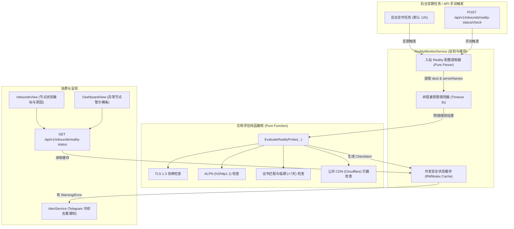

# Spec: Reality 域名合规性定期监测与面板告警 - 技术契约

- **关联 Intent**: reality-domain-monitor
- **主导设计人**: Subagent Planner
- **当前状态**: In-Review
- **Change Tier**: Tier 2 (单模块特性演进)

---

## 1. 架构流向与设计方案

本方案为 Xray Reality 入站伪装域名的网络合规性提供**低耦合、高可测、无阻塞**的定期巡检与告警机制。

### 1.1 核心架构与数据流图



### 1.2 状态机与判定规则 (Status & Evaluation Rules)

探测器按照以下确定性顺序进行评估，并产出最终判定：
1. **TCP 连通性**：
   - 探测超时（3s）或连接被拒绝 -> `status: error`, `errorType: TCP_UNREACHABLE`
2. **TLS 握手协议版本**：
   - 协商版本低于 TLS 1.3 (`state.Version < tls.VersionTLS13`) -> `status: error`, `errorType: TLS_VERSION_LOW`（Reality 强制要求 TLS 1.3，否则客户端无法完成真实伪装握手）
3. **公共 CDN 判定 (Cloudflare 特征)**：
   - 证书 Issuer/Subject 含 `Cloudflare`，或响应头命中 `Server: cloudflare` / `cf-ray` -> `status: error`, `errorType: CDN_DETECTED`（套用 CDN 导致 Reality 穿透失败并极易被流量特征识别）
4. **证书有效性与过期**：
   - 域名不匹配 (`cert.VerifyHostname(sni) != nil`) -> `status: error`, `errorType: CERT_DOMAIN_MISMATCH`
   - 证书已过期 (`now > cert.NotAfter`) -> `status: error`, `errorType: CERT_EXPIRED`
   - 证书临期预警 (`cert.NotAfter - now < 7 * 24h`) -> `status: warning`, `errorType: CERT_EXPIRING_SOON`
5. **ALPN 支持**：
   - 协商结果缺少 ALPN 支持 (`state.NegotiatedProtocol == ""`) -> `status: warning`, `errorType: ALPN_MISSING`
6. **合规通过**：
   - 以上全满足 -> `status: ok`, `errorType: ""`

---

## 2. API 与数据契约设计

### 2.1 接口列表

| 路径 | 方法 | 权限 | 描述 |
| :--- | :--- | :--- | :--- |
| `/api/v1/inbounds/reality-status` | `GET` | JWT 管理员 | 获取最新 Reality 伪装域名巡检状态汇总与明细 |
| `/api/v1/inbounds/reality-status/check` | `POST` | JWT 管理员 | 立即触发一次全量检测并返回最新结果 |

### 2.2 数据模型 (Domain Models)

```go
package domain

import "time"

type RealityDomainStatus string

const (
	RealityStatusOk      RealityDomainStatus = "ok"
	RealityStatusWarning RealityDomainStatus = "warning"
	RealityStatusError   RealityDomainStatus = "error"
)

// RealityCheckItem 单个 ServerName 的检测明细
type RealityCheckItem struct {
	InboundID   uint                `json:"inboundId"`
	InboundTag  string              `json:"inboundTag"`
	Dest        string              `json:"dest"`
	ServerName  string              `json:"serverName"`
	Status      RealityDomainStatus `json:"status"`               // ok | warning | error
	ErrorType   string              `json:"errorType,omitempty"`  // TCP_UNREACHABLE, TLS_VERSION_LOW, ALPN_MISSING, CERT_EXPIRED, CERT_EXPIRING_SOON, CDN_DETECTED, CERT_DOMAIN_MISMATCH
	Details     string              `json:"details"`              // 详细人类可读原因
	TLSVersion  string              `json:"tlsVersion,omitempty"` // 如 "TLS 1.3"
	ALPN        string              `json:"alpn,omitempty"`       // 如 "h2"
	CertExpiry  string              `json:"certExpiry,omitempty"` // 如 "2026-10-15 12:00:00"
	DaysLeft    int                 `json:"daysLeft"`             // 证书剩余天数
	LatencyMs   int64               `json:"latencyMs"`            // 握手延迟毫秒
	CheckedAt   time.Time           `json:"checkedAt"`
}

// RealitySummaryStatus 巡检总体聚合快照
type RealitySummaryStatus struct {
	TotalChecked int                `json:"totalChecked"`
	OkCount      int                `json:"okCount"`
	WarningCount int                `json:"warningCount"`
	ErrorCount   int                `json:"errorCount"`
	Items        []RealityCheckItem `json:"items"`
	LastCheckAt  time.Time          `json:"lastCheckAt"`
}
```

### 2.3 接口响应示例 (`GET /api/v1/inbounds/reality-status`)

```json
{
  "totalChecked": 2,
  "okCount": 1,
  "warningCount": 0,
  "errorCount": 1,
  "lastCheckAt": "2026-09-20T15:30:00Z",
  "items": [
    {
      "inboundId": 1,
      "inboundTag": "vless-reality",
      "dest": "gateway.icloud.com:443",
      "serverName": "gateway.icloud.com",
      "status": "ok",
      "errorType": "",
      "details": "域名检测正常 (支持 TLS 1.3 与 ALPN, 证书有效)",
      "tlsVersion": "TLS 1.3",
      "alpn": "h2",
      "certExpiry": "2026-11-20 00:00:00",
      "daysLeft": 61,
      "latencyMs": 42,
      "checkedAt": "2026-09-20T15:30:00Z"
    },
    {
      "inboundId": 3,
      "inboundTag": "vless-cf-bad",
      "dest": "1.1.1.1:443",
      "serverName": "cloudflare.com",
      "status": "error",
      "errorType": "CDN_DETECTED",
      "details": "目标站点套用了 Cloudflare 公共 CDN，存在盗流与特征拦截风险",
      "tlsVersion": "TLS 1.3",
      "alpn": "h2",
      "certExpiry": "2026-10-01 00:00:00",
      "daysLeft": 11,
      "latencyMs": 18,
      "checkedAt": "2026-09-20T15:30:00Z"
    }
  ]
}
```

---

## 3. 可测性设计 (Design for Testability)

为了杜绝偶发网络依赖，本设计强制将“**纯规则推导核**”与“**网络 IO 探测**”解耦。

### 3.1 独立纯函数计算核

1. `ExtractRealityTargets(inbound *domain.Inbound) (dest string, serverNames []string, isReality bool)`:
   - 纯入参/出参函数，无副作用；
   - 完整测试单数 `serverName`、复数 `serverNames`、缺省 `dest` 等边界解析。
2. `EvaluateRealityProbe(tcpErr error, tlsVer uint16, alpn string, cert *x509.Certificate, headers http.Header, now time.Time) (domain.RealityDomainStatus, string, string)`:
   - 纯算法判定函数，传入 mock 的证书、TLS 版本与 HTTP 响应头即可穷尽验证全部状态分支，100% 覆盖：
     - `tcpErr != nil` -> `TCP_UNREACHABLE`
     - `tlsVer != tls.VersionTLS13` -> `TLS_VERSION_LOW`
     - `server: cloudflare` / `cf-ray` -> `CDN_DETECTED`
     - `cert.NotAfter < now` -> `CERT_EXPIRED`
     - `cert.NotAfter - now < 7d` -> `CERT_EXPIRING_SOON`
     - `alpn == ""` -> `ALPN_MISSING`

### 3.2 外部依赖与 Mock 策略

- 定义探测接口：
  ```go
  type RealityProber interface {
      Probe(ctx context.Context, dest, serverName string) (*domain.RealityCheckItem, error)
  }
  ```
- 单元测试中注入 `MockRealityProber`，无需真实公网连通即可模拟延迟、网络抖动与握手失败；
- 真实实现 `DefaultRealityProber` 使用 `net.Dialer{Timeout: 3*time.Second}` 与 `tls.Client`，严格受 `context.WithTimeout` 约束。

---

## 4. 联动与告警设计 (Alerting & UI Integration)

### 4.1 AlertService 联动与防刷屏冷却

- `AlertService` 提供 `NotifyRealityAbnormal(ctx context.Context, item domain.RealityCheckItem) error`；
- **防刷屏机制**：使用内存 Cache，以 `reality_alert:<inboundTag>:<serverName>:<errorType>` 为键设置 24 小时冷却时间；只有发生新类型异常或冷却期满后才再次触发；
- **通知渠道**：通过 `domain.Notifier.SendMessage` 推送精美格式化的 Telegram 告警卡片，避免破坏现有的 `Notifier` 接口签名。

### 4.2 前端呈现交互

1. **InboundsView (入站网关列表)**:
   - 在卡片基础信息区，展示 Reality 伪装域名状态徽标：
     - 绿色 `ok`: “Reality 正常 (TLS 1.3 / h2)”
     - 橙色 `warning`: “Reality 预警: [原因]”
     - 红色 `error`: “Reality 异常: [原因]”
   - Tooltip 悬浮展示详细 dest、ServerName 及证书剩余天数；
   - 列表顶部增加“检测伪装域名”按钮，支持手动触发刷新。
2. **DashboardView (系统仪表盘)**:
   - 当汇总中存在 `errorCount > 0` 或 `warningCount > 0` 时，在概览顶部展示提示横幅（Banner），点击可直接跳转至 `/inbounds`。

---

## 5. 替代方案与权衡考量 (Alternatives Considered & Trade-offs)

| 方案 | 优劣势与权衡分析 | 决策结论 |
| :--- | :--- | :--- |
| **方案 A: 存入 SQLite 数据库** | 优点是重启后记录不丢；缺点是高频写入污染 WAL，且域名巡检属于高时效运行态，历史无持久化价值。 | **否决**。采用内存缓存，轻量且零 Schema 迁移成本。 |
| **方案 B: 每次打开面板实时探测全部域名** | 优点是永远最新；缺点是入站较多时阻塞 HTTP 页面加载达数秒，极易造成请求超时。 | **否决**。后台周期巡检 + 内存读写锁缓存，API 亚毫秒响应。 |
| **方案 C: 发现异常自动切换或关闭入站** | 看似智能，但外部网络波动或探针误判可能导致业务被意外切断，破坏系统可用性底线。 | **否决**（违反红线）。仅告警，绝不擅自篡改配置。 |

---

## 6. 动态风险核验与回滚预案 (Risk & Rollback Verification)

### 6.1 七维风险核验矩阵

- [x] **1. Affected Files**: 变动局限在巡检 Service、HTTP Handler、Router 注册及前端 2 个 View 组件，无交叉污染。
- [x] **2. Public API & Protocol**: 仅新增 2 个管理端 REST 端点，现有所有端点契约零破坏。
- [x] **3. Data Schema**: 数据库表零修改，完全保存在内存态中。
- [x] **4. Auth & Security**: 接口置于管理员 JWT 保护下；探测限定只读 SNI 握手与超时熔断，防止探测放大。
- [x] **5. Dependencies**: 零外部第三方依赖，全部采用标准库 `crypto/tls`、`net`、`net/http`。
- [x] **6. Rollback Difficulty**: 极低，前端降级不影响使用，后端直接注销路由或移除 Goroutine 即可秒级回滚。
- [x] **7. Blast Radius**: 探针独立 Goroutine + Context 超时，彻底与 Xray 核心转发隔离，爆炸半径为零。

### 6.2 回滚与故障应急策略

- 若探测引发异常开销，可在后台关闭定时巡检定时器，面板仅提供手动查询；
- 前端对状态字段具备空安全兜底（`status?.items || []`），后端无数据时不影响任何基础操作。

---

## 7. 阶段准出签批 (Gate 2 Sign-off)

- [x] 架构流向与 API 契约已冻结
- [x] 替代方案已完成推演与权衡
- [x] 7 维风险已核验且具备明确回滚预案
- **审查结论**: Accepted
- **签批人 / 日期**: User / 2026-09-20 15:55
