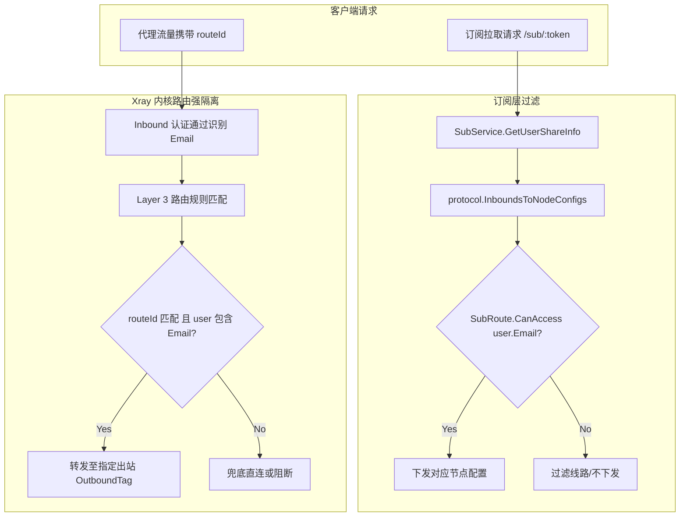

# Spec: SubRoute 节点分流线路细粒度用户权限隔离 - 技术契约

- **关联 Intent**: subroute-user-isolation
- **主导设计人**: Dev
- **当前状态**: In-Review

---

## 1. 架构流向与设计方案

本方案在 **展示层（订阅下发）** 与 **核心引擎层（Xray 路由执行）** 建立双重安全隔离机制，遵循最小特权原则与纵深防御架构：

1. **领域模型与数据层**：
   - 在领域模型 `domain.SubRoute` 增加 `AllowedUsers []string` (`json:"allowedUsers,omitempty"`)，存储获准访问该线路的用户邮箱列表。
   - 提供核心纯函数方法 `CanAccess(email string) bool`：当 `len(AllowedUsers) == 0` 时开放给 Inbound 下所有授权用户（返回 `true`，存量无缝兼容）；当配置了邮箱时，严格遍历匹配传入的邮箱。
   - 继续存储于入站记录的 `inbounds.sub_routes_json` 字段，无需修改数据库 DDL。

2. **订阅与节点生成层（展示级过滤）**：
   - `internal/service/sub_service.go` 的 `GetUserShareInfo`：当 Inbound 拥有 SubRoutes 时，遍历 SubRoutes 增加 `!sr.CanAccess(user.Email)` 判定，未授权线路予以跳过。若全部 SubRoutes 均未授权，该 Inbound 对该用户生成 0 个节点。
   - `internal/protocol/node_converter.go` 的 `InboundsToNodeConfigs`：遍历 SubRoutes 时，同样依据 `!sr.CanAccess(user.Email)` 进行过滤。若某 Inbound 配置了 SubRoutes 但无任何 SubRoute 匹配当前用户，该 Inbound 产出 0 个 `NodeConfig`。

3. **Xray 路由引擎层（底层强隔离，防御手工伪造 routeId 越权）**：
   - `internal/adapter/xray/schema.go` 的 `XrayRoutingRule` 增加 `User []string` (`json:"user,omitempty"`) 字段。
   - `internal/adapter/xray/compiler.go` 在编译 Layer 3 分流规则（`vlessRoute`）时，若 `len(sr.AllowedUsers) > 0`，将 `sr.AllowedUsers` 赋给 `XrayRoutingRule.User`。
   - Xray 引擎内核在处理入站流量时，会基于客户端凭证（Email）和请求的 `routeId` 双重比对规则；未授权用户即使获知并伪造了 `routeId`，由于未命中该规则，流量将无法穿透至对应受保护出站。

4. **前端交互与数据流向**：
   - 在 `web/src/views/InboundsView.vue` 分流线路配置抽屉中，每条 SubRoute 增加授权用户多选控制（展示已有用户邮箱列表）。
   - 未选择任何用户（空数组）时提示“全员开放”，选中特定用户时存储对应的 Email 数组，与后端 `subRoutesJson` 契约严格对齐。



---

## 2. API 与数据契约设计

### 2.1 领域模型契约 (`internal/domain/inbound.go`)
```go
type SubRoute struct {
    ID           string   `json:"id"`                     // 唯一标识
    Name         string   `json:"name"`                   // 线路名称
    RouteID      uint16   `json:"routeId"`                // 16 位路由编号 (1 ~ 65535)
    OutboundTag  string   `json:"outboundTag"`            // 目标出站标签
    Enabled      bool     `json:"enabled"`                // 是否启用
    AllowedUsers []string `json:"allowedUsers,omitempty"` // 允许访问的用户 Email 列表（为空表示全员开放）
}

// CanAccess 校验指定用户是否有权访问此分流线路
func (sr SubRoute) CanAccess(email string) bool {
    if len(sr.AllowedUsers) == 0 {
        return true
    }
    for _, u := range sr.AllowedUsers {
        if u == email {
            return true
        }
    }
    return false
}
```

### 2.2 Xray 规则契约 (`internal/adapter/xray/schema.go`)
```go
type XrayRoutingRule struct {
    Type        string   `json:"type"` // field
    Tag         string   `json:"tag,omitempty"`
    InboundTag  []string `json:"inboundTag,omitempty"`
    OutboundTag string   `json:"outboundTag"`
    VlessRoute  string   `json:"vlessRoute,omitempty"`
    User        []string `json:"user,omitempty"`       // 指定匹配的用户 Email 列表
    Domain      []string `json:"domain,omitempty"`
    IP          []string `json:"ip,omitempty"`
    Port        string   `json:"port,omitempty"`
    Network     string   `json:"network,omitempty"`
    Protocol    []string `json:"protocol,omitempty"`
    Attrs       string   `json:"attrs,omitempty"`
}
```

### 2.3 编译器生成规则 (`internal/adapter/xray/compiler.go`)
在 Layer 3 分流编译逻辑中：
```go
for _, sr := range inb.GetSubRoutes() {
    if sr.Enabled && sr.RouteID > 0 && sr.OutboundTag != "" {
        rule := XrayRoutingRule{
            Type:        "field",
            InboundTag:  []string{inb.Tag},
            VlessRoute:  fmt.Sprintf("%d", sr.RouteID),
            OutboundTag: sr.OutboundTag,
        }
        if len(sr.AllowedUsers) > 0 {
            rule.User = sr.AllowedUsers
        }
        layeredRules = append(layeredRules, rule)
    }
}
```

### 2.4 前端持久化契约 (`web/src/views/InboundsView.vue`)
前端保持与现有 `subRoutesJson` 传输契约一致，表单对象扩展：
```typescript
interface SubRouteFormItem {
  id: string
  name: string
  routeId: number
  outboundTag: string
  enabled: boolean
  allowedUsers?: string[] // 用户 email 数组
}
```

---

## 3. 可测性设计 (Design for Testability)

* **独立纯函数计算核**:
  - `domain.SubRoute.CanAccess(email string) bool`：纯内存对比，不依赖任何 I/O 或数据库，针对空列表、命中列表、未命中列表进行 100% 覆盖率单测。
  - `protocol.InboundsToNodeConfigs`：给定包含不同 `AllowedUsers` 的 `Inbound` 与不同 `User`，断言输出的 `[]*NodeConfig` 数量及 `routeId` 是否完全精确。
  - `xray.XrayCompiler.Compile`：断言生成的 JSON 中 Layer 3 路由规则的 `user` 字段与 SubRoute 的 `allowedUsers` 完全一致，且未配置时不出现 `user` 字段（omitempty）。
* **外部依赖与 Mock 策略**:
  - 核心逻辑全部位于无副作用的纯计算层与领域层，无需 Mock 外部服务；测试中通过构造内存模型即可实现端到端确定性断言。

---

## 4. 替代方案与权衡考量 (Alternatives Considered & Trade-offs)

* **替代方案 1：引入数据库关联表 `inbound_sub_route_users`**
  - **评估**: 将 SubRoute 与用户关系独立建表，利用外键与关系查询进行管理。
  - **未采纳原因**: 过度工程化（违反 KISS 原则）。SubRoute 目前即作为 JSON 嵌入存储于 `inbounds.sub_routes_json`，若为其单独建表会导致存储模型割裂，增加无谓的数据库迁移与事务复杂度。在 JSON 中直接维护 `allowedUsers` 邮箱数组轻量且足以承载规模需求。
* **替代方案 2：未命中任何 SubRoute 时自动回退至 Inbound 默认基础节点 (routeId=0)**
  - **评估**: 当一个 Inbound 配置了 SubRoutes 但某用户全未命中时，自动兜底生成基础节点。
  - **未采纳原因**: 存在安全隐患与非预期泄露。若管理员已将该 Inbound 改造为纯分流总线，未授权用户若自动获得默认出口，违背安全最小特权原则。因此采纳严格下发 0 个节点的方案。
* **替代方案 3：仅在订阅下发层做展示过滤，不改动 Xray 路由规则**
  - **评估**: 仅过滤分享链接和订阅，不修改 Layer 3 XrayRoutingRule。
  - **未采纳原因**: 防君子不防小人。拥有 Inbound 凭证的高级用户只要在客户端手动修改或暴力枚举 `routeId`，即可越权访问受保护出站。必须在 Xray 路由引擎注入 `user` 字段实现物理级拦截。

---

## 5. 动态风险核验与回滚预案 (Risk & Rollback Verification)

* [x] 已检查 7 大风险维度 (Files, API, Schema, Auth, Deps, Migration, Blast Radius)
* [x] 确认当前 Change Tier 评级准确（Tier 3 跨领域重构：触及领域模型、订阅解析、Xray 路由内核与前端面板）
* **7 维动态风险扫描**:
  1. **Affected Files**: 约 5 个后端核心文件（`inbound.go`, `sub_service.go`, `node_converter.go`, `schema.go`, `compiler.go`）与 1 个前端文件（`InboundsView.vue`），文件范围聚焦且无跨边界冗余修改。
  2. **Public API & Protocol**: 接口路由与协议格式不变，`subRoutesJson` 保持向后兼容（新增字段默认缺省为全员开放）。
  3. **Data Schema**: 0 数据库 DDL 变更，无迁移脚本风险。
  4. **Auth & Security**: 安全大幅增强，杜绝 routeId 越权伪造穿透风险。
  5. **Dependencies**: 零第三方外部依赖引入。
  6. **Rollback Difficulty**: 状态高度可逆。代码回退后，历史 JSON 中的 `allowedUsers` 字段会被忽略，不影响系统正常运行。
  7. **Blast Radius**: 局限于启用了 SubRoutes 的入站线路及其用户订阅与路由分流，普通入站完全不受影响。
* **回滚与故障应急策略**:
  - 代码级别直接 `git revert`。由于无数据库 Schema 变更，回滚过程秒级生效且无数据脏写风险。

---

## 6. 阶段准出签批 (Gate 2 Sign-off)
- [ ] 架构流向与 API 契约已冻结
- [ ] 替代方案已完成推演与权衡
- [ ] 7 维风险已核验且具备明确回滚预案
- **审查结论**: Pending
- **签批人 / 日期**: [待人类签批] / 2026-09-21
