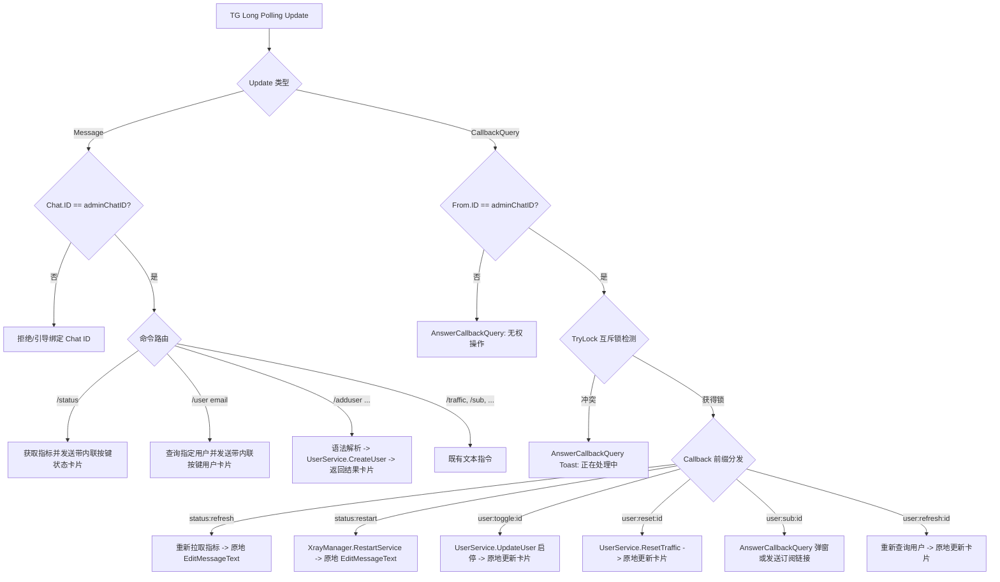

# Spec: Telegram Bot 交互体验与运维管控能力增强 - 技术契约

- **关联 Intent**: tg-bot-enhancement
- **主导设计人**: Dev
- **当前状态**: Draft
- **创建时间**: 2026-09-20 17:45

---

## 1. 架构流向与设计方案

### 1.1 事件调度与长轮询接入流向
`BotHandler.Start` 在既有的 `pollLoop` 中全面升级对 Telegram `Update` 类型的解析与分发：
1. **Message 分发**: `update.Message != nil` 时交由 `handleMessage(ctx, update.Message)` 处理；
2. **CallbackQuery 分发**: `update.CallbackQuery != nil` 时交由 `handleCallbackQuery(ctx, update.CallbackQuery)` 处理；
3. **鉴权守卫**: 无论指令消息还是内联按钮回调，统一执行 `adminChatID` 鉴权：
   - 若未配置 `adminChatID`，仅提示用户其 Chat ID 并指引面板绑定；
   - 若发起者 ID (`msg.Chat.ID` 或 `cb.From.ID`) 不等于 `adminChatID`，Message 拒绝回复，CallbackQuery 执行 `AnswerCallbackQuery("⛔ 无权操作", showAlert=true)` 并阻断；
4. **应答与防重放机制 (Debounce & Anti-replay)**:
   - 所有 CallbackQuery 均通过 `defer` 或即时调用 `AnswerCallbackQuery` 消除客户端加载中菊花；
   - 针对长耗时/状态突变操作（如 `status:restart`、`user:reset`、`user:toggle`），通过 `sync.Mutex.TryLock()` 设置全局或操作级别并发锁，并发连击时通过 Callback Toast 提示 `⚠️ 操作正在执行中，请勿重复点击`。



### 1.2 依赖解耦与接口定义 (DIP & ISP)
为避免在 Telegram Adapter 中直接耦合底层仓库或破坏领域边界，定义最小化的用户业务管理契约：
```go
// UserServiceController 定义 Telegram Bot 所需的用户业务编排契约 (遵循 ISP 原则)
type UserServiceController interface {
    CreateUser(ctx context.Context, dto service.CreateUserDTO) (*domain.User, error)
    UpdateUser(ctx context.Context, id uint, dto domain.UpdateUserDTO) (*domain.User, error)
    ResetTraffic(ctx context.Context, id uint) error
    GetByID(ctx context.Context, id uint) (*domain.User, error)
    GetByEmail(ctx context.Context, email string) (*domain.User, error)
}
```
由 `internal/service.UserService` 实现，`BotHandler` 仅依赖此接口，完全保持整洁架构。

---

## 2. API 与数据契约设计

### 2.1 Telegram 指令集规范
| 命令格式 | 参数说明 | 行为与输出契约 |
| :--- | :--- | :--- |
| `/status` | 无 | 输出系统 CPU/内存/磁盘/网络速率及 Xray 核心运行态与版本号；附带内联刷新与重启按钮。 |
| `/user <email>` | `<email>`: 用户邮箱(必填) | 查询用户状态并输出详情卡片；附带动态启停、重置流量、获取订阅与刷新按钮。 |
| `/adduser <email> [GB] [天数]` | `<email>`(必填), `[GB]`(选填, 默认0不限), `[天数]`(选填, 默认0不过期) | 自动挂载当前所有可用 Inbound 节点，创建用户并返回包含专属订阅 URL 的结果卡片。 |

### 2.2 Callback Data 编码规范
遵循 Telegram 回调数据 `<= 64 bytes` 的硬性约束，统一采用冒号分隔路由格式 `<domain>:<action>[:<param>]`：
- `status:refresh`: 原地刷新 `/status` 系统与核心指标卡片（耗时极短，原地 EditMessageText 并更新时间戳）。
- `status:restart`: 执行核心平滑重启，处理期间禁用连击，完成后更新卡片文本与状态。
- `user:toggle:<userID>`: 翻转指定用户的 `Enabled` 状态（调用 `UpdateUser`），原地更新卡片文本与对应按键状态（`[⛔ 禁用]` <-> `[✅ 启用]`）。
- `user:reset:<userID>`: 清空指定用户当月已用上传/下载流量并重置内存计数器，原地更新卡片。
- `user:sub:<userID>`: 触发订阅链接弹窗 (AnswerCallbackQuery showAlert=true) 或发送订阅卡片。
- `user:refresh:<userID>`: 重新加载该用户的最新数据库记录并原地刷新卡片。

### 2.3 卡片文本与内联按键布局规范
1. **`/status` 卡片布局**:
   - 文本内容：CPU 使用率、内存占用与百分比、磁盘占用、实时上下行网速、开机时长、Xray 运行状态、版本号、更新时间戳。
   - Inline Keyboard:
     ```
     [ 🔄 刷新指标 (status:refresh) ] | [ ⚡ 重启核心 (status:restart) ]
     ```
2. **`/user <email>` 卡片布局**:
   - 文本内容：用户邮箱、UUID、状态（🟢 正常 / 🔴 已禁用 / ⚠️ 已过期 / ⚠️ 流量超额）、已用/总量配额、到期时间、重置日。
   - Inline Keyboard:
     ```
     [ ⛔ 禁用用户 (user:toggle:id) ] | [ 🔄 重置流量 (user:reset:id) ]
     [ 🔗 获取订阅 (user:sub:id) ]    | [ 🔄 刷新状态 (user:refresh:id) ]
     ```
     *(注：若用户当前已被禁用，首按钮文案动态显示为 `[ ✅ 启用用户 ]`)*

---

## 3. 可测性设计 (Design for Testability)

### 3.1 独立纯函数计算核 (Pure Functions)
将所有字符串拼接、布局排版与语法解析剥离为无副作用的独立纯函数，便于 100% 覆盖率的白盒单元测试：
1. `ParseAddUserCommand(args string) (email string, totalBytes int64, expireDays int, err error)`:
   - 针对 `/adduser` 参数进行空格拆分与正则校验；
   - 涵盖非法字符、非数字配额、负数参数及缺省默认值分支测试。
2. `RenderStatusCard(metrics *domain.SystemMetrics, svcStatus domain.ServiceStatus, xrayVer string, updateTime time.Time) (string, tgbotapi.InlineKeyboardMarkup)`:
   - 纯函数生成 HTML 卡片与内联按钮结构。
3. `RenderUserCard(user *domain.User, publicURL string) (string, tgbotapi.InlineKeyboardMarkup)`:
   - 纯函数根据用户实体状态（激活/禁用/过期/超额）渲染不同状态徽标与自适应按钮。
4. `ParseCallbackData(data string) (domain string, action string, targetID uint, err error)`:
   - 校验 CallbackData 前缀、格式及数值有效性。

### 3.2 外部依赖与 Mock 策略
- `UserServiceController` 与 `XrayServiceController`：通过 Go interface 注入，单测中以标准 Stub/Mock 模拟数据库与 gRPC 返回。
- `Telegram BotAPI`：复用 `internal/adapter/telegram/bot_test.go` 中成熟的 `httptest.Server` 机制，拦截 `editMessageText`、`answerCallbackQuery`、`sendMessage`，完全在离线环境下完成全链路回归测试。

---

## 4. 替代方案与权衡考量 (Alternatives Considered & Trade-offs)

| 方案 | 优劣势与权衡分析 | 结论 |
| :--- | :--- | :--- |
| **方案 A (采纳): 原生 InlineKeyboardMarkup + Callback 原地编辑** | 优势：极致零刷屏体验，状态变更一目了然；无额外依赖，复用现有 tgbotapi。劣势：需实现简单的回调路由与并发防护。 | **采纳** |
| **方案 B: 传统回复新消息 (New Message Reply)** | 优势：实现简单无状态。劣势：群组或私聊中产生大量历史垃圾消息，极度影响移动端查看体验。 | 放弃 |
| **方案 C: 引入第三方复杂 Bot 状态机框架 (如 Telebot)** | 优势：自带 DSL 语法糖。劣势：增加外部重型依赖，与现有 `tgbotapi/v5` 冲突，严重违反 KISS 规范。 | 放弃 |

---

## 5. 动态风险核验与回滚预案 (Risk & Rollback Verification)

### 5.1 7 大风险维度核验
1. **Affected Files**: 仅涉及 `internal/adapter/telegram/bot.go`、`internal/adapter/telegram/bot_test.go` 以及 `main.go` 构造传参调整，范围控制在 3 个文件以内。
2. **Public API & Protocol**: 不改动任何现存 Web REST API 与订阅协议，仅扩展 Telegram 私有交互。
3. **Data Schema**: 零数据库 Schema 改动，零迁移依赖。
4. **Auth & Security**: 严格校验 `adminChatID`；CallbackQuery 校验 `cb.From.ID`；长耗时操作防重放/防并发连击；敏感 Token 不明文暴露到非管理员通道。
5. **Dependencies**: 零新增外部依赖，复用项目已引入的 `github.com/go-telegram-bot-api/telegram-bot-api/v5`。
6. **Rollback Difficulty**: 完全向后兼容，代码可单 commit 原子回滚。
7. **Blast Radius**: 故障域严格局限在 Telegram 交互模块内，即便 Bot 轮询或网络故障，完全不影响核心代理转发与 Web 控制台运行。

### 5.2 确认 Change Tier 评级
- 经 7 维全面复核，本次变更无架构溢出与跨域重构风险，维持 **Tier 2 (单模块特性演进)**。

### 5.3 回滚与故障应急策略
- 若新交互逻辑在生产环境出现异常，可快速在面板系统设置中清空 `tg_bot_token` 停用机器人服务，或通过 Git 快速回滚发布。

---

## 6. 阶段准出签批 (Gate 2 Sign-off)
- [ ] 架构流向与 API 契约已冻结
- [ ] 替代方案已完成推演与权衡
- [ ] 7 维风险已核验且具备明确回滚预案
- **审查结论**: Pending
- **签批人 / 日期**: [待人类签批] / 2026-09-20 17:45
