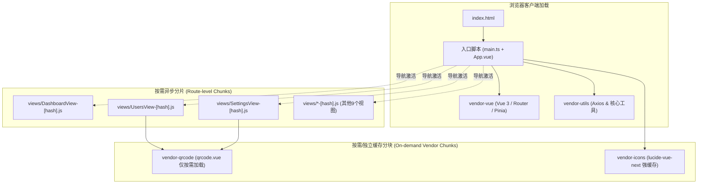

# Spec: 前端包体与打包体积优化 - 技术契约

- **关联 Intent**: web-bundle-optimization
- **主导设计人**: Dev
- **当前状态**: In-Review
- **评定 Change Tier**: Tier 2 (局部构建工程与展示层演进)

---

## 1. 架构流向与设计方案

### 1.1 现状与瓶颈分析
当前前端工程构建体系采用 Vite 5 + Vue 3 + Tailwind CSS。经过只读代码审计与结构探查，发现以下关键瓶颈：
1. **路由同步全量载入**: `web/src/router/index.ts` 采用静态 `import ... from '../views/*.vue'` 导入全部 12 个视图组件，导致所有页面模板、逻辑与依赖在入口处被打入单一庞大 JS bundle (`index-*.js`)。
2. **缺乏 Vendor 分块策略**: `web/vite.config.ts` 仅有基础 alias 和 proxy 配置，缺少 `build.rollupOptions.output.manualChunks` 细化声明，所有三方库（`vue`, `vue-router`, `pinia`, `axios`, `lucide-vue-next`, `qrcode.vue` 等）与业务代码混杂，缓存失效代价极高。
3. **重型依赖首屏污染**: `qrcode.vue` 仅在 `SettingsView` 与 `UsersView` 中使用，但由于静态导入机制，强制进入首屏 bundle；`lucide-vue-next` 虽然使用具名解构导入，但未经独立分块，业务频繁变动会导致图标依赖长期缓存失效。

### 1.2 优化架构分块与加载流向


### 1.3 技术契约与实现规范

#### 1. 路由动态懒加载契约 (`web/src/router/index.ts`)
将全部视图组件从顶层静态同步引用转为符合 ES 标准的动态 `() => import(...)` 形式：
```typescript
// 路由组件按需懒加载定义
const LoginView = () => import('../views/LoginView.vue')
const PortalClaimView = () => import('../views/PortalClaimView.vue')
const DashboardView = () => import('../views/DashboardView.vue')
const TopologyView = () => import('../views/TopologyView.vue')
const InboundsView = () => import('../views/InboundsView.vue')
const OutboundsView = () => import('../views/OutboundsView.vue')
const RoutingView = () => import('../views/RoutingView.vue')
const DNSView = () => import('../views/DNSView.vue')
const UsersView = () => import('../views/UsersView.vue')
const ConfigView = () => import('../views/ConfigView.vue')
const LogsView = () => import('../views/LogsView.vue')
const SettingsView = () => import('../views/SettingsView.vue')
```
- 保留 `router.beforeEach` 与 `router.afterEach` 导航守卫行为与状态机不变；
- 首屏仅下载激活路由所需的异步分片，非访问页面代码零预先开销。

#### 2. Vite/Rollup 分块构建契约 (`web/vite.config.ts`)
在 `build.rollupOptions` 下配置精细的 `manualChunks` 函数与分块规则：
```typescript
build: {
  outDir: 'dist',
  emptyOutDir: true,
  chunkSizeWarningLimit: 600,
  rollupOptions: {
    output: {
      manualChunks(id) {
        if (id.includes('node_modules')) {
          if (id.includes('vue') || id.includes('vue-router') || id.includes('pinia')) {
            return 'vendor-vue'
          }
          if (id.includes('lucide-vue-next')) {
            return 'vendor-icons'
          }
          if (id.includes('qrcode.vue')) {
            return 'vendor-qrcode'
          }
          if (id.includes('axios')) {
            return 'vendor-utils'
          }
          return 'vendor-libs'
        }
      },
      chunkFileNames: 'assets/js/[name]-[hash].js',
      entryFileNames: 'assets/js/[name]-[hash].js',
      assetFileNames: 'assets/[ext]/[name]-[hash].[ext]',
    },
  },
}
```

#### 3. Tree-shaking 与依赖按需引入校验
- **Lucide-vue-next**: 经源码全局检索（14处引用点），全部使用形如 `import { X, Check } from 'lucide-vue-next'` 具名解构，无通配符命名空间导入；确保 Rollup ESM 静态分析能够完全 Tree-shake 未使用的数百个图标组件。
- **qrcode.vue**: 确认为受限依赖，仅注入 `UsersView` 与 `SettingsView`，结合路由懒加载与 `vendor-qrcode` 策略，完全隔离在次要交互路径。

---

## 2. API 与数据契约设计
* **接口契约改动**: 零改动。前后端 HTTP RESTful 路由、入参/出参 DTO、状态码及 WebSocket/SSE 协议保持 100% 兼容。
* **浏览器缓存契约**: 
  - 核心入口 `index.html` 采用 `Cache-Control: no-cache`；
  - 静态资源 `assets/**/*-[hash].*` 配置不可变长效缓存（`Cache-Control: public, max-age=31536000, immutable`），实现极低的首屏与二次回访开销。

---

## 3. 可测性设计 (Design for Testability)

### 3.1 独立断言与构建核
1. **分块隔离断言**:
   - `dist/assets/js/` 目录下必须存在分离的 `vendor-vue-*.js`、`vendor-icons-*.js`、`vendor-qrcode-*.js` 及各自路由分片。
   - 单一产物 chunk 体积严格受控于 500kB~600kB 阈值内，构建控制台输出零 `[!] Some chunks are larger than 500 kBs` 警告。
2. **类型与语法契约完整性**:
   - 执行 `cd web && npm run typecheck` 验证动态导入下 Vue SFC 及 TypeScript 类型无断裂。
   - 执行 `cd web && npm run build` 构建耗时与产物生成无错误。
3. **后端只读集成验证**:
   - 验证后端集成与单元测试：`go test -race ./...`。

---

## 4. 替代方案与权衡考量 (Alternatives Considered & Trade-offs)

1. **替代方案 A：全量单一 Vendor (`manualChunks: { vendor: ['vue', ...] }`)**
   - *缺陷*: 将所有三方库粗暴打包为单个 mega vendor，虽然避免了业务更新影响库，但单个 vendor chunk 体积仍容易超过 500kB，且用户未访问二维码功能时也被迫下载 qrcode 库。
   - *决策*: 否决。选用细粒度功能域切分（vue 基础、图标、特定视图工具）。
2. **替代方案 B：引入 `vite-plugin-compression` 生成 Gzip/Brotli 预压缩文件**
   - *缺陷*: 引入额外构建插件依赖；后端静态文件服务（或 Go embed）若未配置 Content-Encoding 探测，直接输出 .gz 会导致额外复杂度。
   - *决策*: 当前阶段优先通过规范 Rollup 代码分割与路由懒加载解决体积根因，不盲目引入构建插件依赖（遵循 KISS 原则）。

---

## 5. 动态风险核验与回滚预案 (Risk & Rollback Verification)

### 5.1 7 大风险维度核验扫描
1. **Affected Files**: 仅影响 `web/vite.config.ts` 和 `web/src/router/index.ts`（2个文件），改动极度局部受控。
2. **Public API & Protocol**: 无任何 API、Header、状态码或协议变更。
3. **Data Schema**: 不涉及任何数据库 Schema、配置存储与持久化格式。
4. **Auth & Security**: 路由守卫 `router.beforeEach` 的 Token 验证、登录拦截及 Mock 降级分支逻辑 1:1 原样保持，鉴权链路无破坏。
5. **Dependencies**: 零新增外部依赖，纯利用 Vite 5 / Rollup 原生分块配置。
6. **Rollback Difficulty**: 极低。纯静态构建配置与标准 ES 语法重构，如遇任何分包加载异常，直接 `git revert` 即可秒级复原。
7. **Blast Radius**: 极小。仅影响前端浏览器资源下载批次与时间，不波及后端核心业务、转发逻辑与 gRPC 通信。

### 5.2 综合风险定级与回滚应急策略
- **评级结论**: 风险点全部清晰受控，维持 **Tier 2**。
- **回滚策略**: 若在生产/集成环境出现异步分片 404 或加载竞态，直接回滚至 `router/index.ts` 静态引用与原始 `vite.config.ts`。

---

## 6. 阶段准出签批 (Gate 2 Sign-off)
- [ ] 架构流向与分块契约已冻结
- [ ] 替代方案已完成推演与权衡
- [ ] 7 维风险已核验且具备明确回滚预案
- **审查结论**: Pending
- **签批人 / 日期**: [待人类签批] / 2026-09-20 11:43