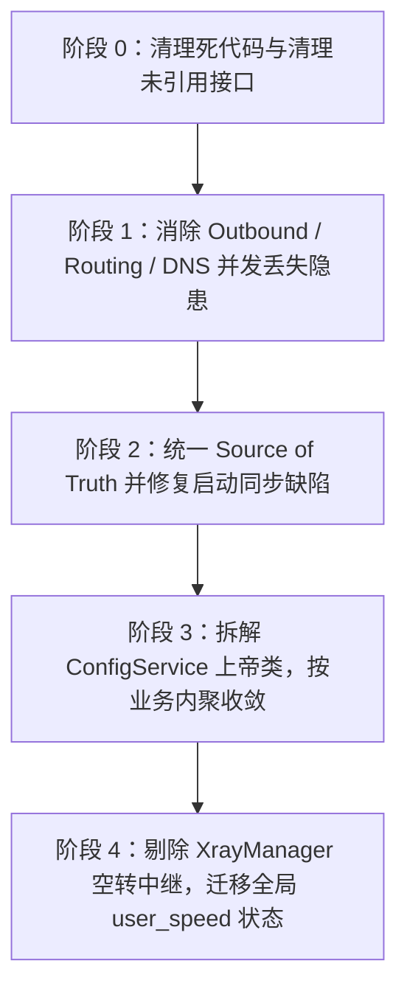

# Xray Decoupled Panel 重构前基线分析全景报告 (Refactoring Baseline Analysis)

> **文档版本**：v1.0.0  
> **基准分析日期**：2026-09-12  
> **适用范围**：系统重构前的工程基准评估、调用链梳理、数据一致性风险排查与重构路线约束。  
> **工程铁律**：重构核心目标是**降低系统认知复杂度，坚决拒绝过度抽象（KISS 原则）**。严禁把“代码更抽象”误认为“架构更好”。如果一个 interface 只有一个实现且没有隔离外部重型依赖，一律使用具体 struct。

---

## 一、 系统全景架构图 (System Architecture)

```mermaid
flowchart TB
    subgraph MainEntry ["程序入口与生命周期 (Main & App)"]
        MAIN["main.go"]
        APP_SVC["internal/app.Service (HTTP / Cron / Bot)"]
    end

    subgraph DeliveryLayer ["接入层 (internal/delivery)"]
        HTTP_ROUTER["http.SetupRouter"]
        CRON_JOB["cron.TrafficSyncJob"]
        H_USER["UserHandler"]
        H_INBOUND["InboundHandler"]
        H_OUTBOUND["OutboundHandler"]
        H_ROUTING["RoutingHandler"]
        H_CONFIG["ConfigHandler"]
        H_SUB["SubHandler"]
        H_SETTING["SettingHandler ⚠️"]
        H_DASH["DashboardHandler"]
        H_TICKET["TicketHandler"]
    end

    subgraph ServiceLayer ["业务服务层 (internal/service)"]
        SVC_CONFIG["ConfigService (God Service ⚠️)"]
        SVC_USER["UserService"]
        SVC_SUB["SubService"]
        SVC_MONITOR["MonitorService"]
        SVC_ALERT["AlertService"]
        SVC_TICKET["TicketService"]
    end

    subgraph DomainLayer ["领域层 (internal/domain)"]
        DOM_MODELS["User / Inbound / Setting / Ticket"]
        DOM_REPOS["Repository & Monitor & Notifier Interfaces"]
        DOM_GLOBAL["user_speed.go (全局内存变量 ⚠️)"]
    end

    subgraph ProtocolSub ["客户端订阅与协议转换 (protocol & sub)"]
        PROTO_REG["protocol.Registry (策略模式)"]
        PROTO_FORMATTERS["VLESS / VMess / Trojan / Hy2 / SS"]
        SUB_EXPORTERS["sub.ExportSubscription (Clash / Sing-box / B64)"]
    end

    subgraph AdapterLayer ["适配器与基础设施层 (internal/adapter)"]
        REPO_SQLITE["adapter/repository (SQLite GORM)"]
        XRAY_MGR["adapter/xray.Manager (空转中继 ⚠️)"]
        XRAY_GRPC["adapter/xray.GRPCClient (gRPC)"]
        XRAY_COMPILER["adapter/xray.XrayCompiler (编译引擎)"]
        XRAY_CFGMGR["adapter/xray.ConfigManager (文件原子读写)"]
        XRAY_SUP["adapter/xray.SystemdSupervisor (进程/服务控制)"]
        TG_BOT["adapter/telegram.BotHandler / BotAdapter"]
        HOST_MON["adapter/monitor.GopsutilMonitor"]
    end

    subgraph ExternalState ["外部与运行时状态 (State Stores)"]
        DB_SQLITE[("data/panel.db (SQLite WAL)")]
        FILE_JSON[("config.json (物理文件)")]
        XRAY_CORE[["Xray-Core Runtime Process"]]
    end

    subgraph OrphanCode ["旧架构孤立死代码 (Dead Code ⚠️)"]
        DEAD_STORAGE["internal/storage (BoltDB)"]
        DEAD_XRAY["internal/xray (BoltDB XrayClient)"]
    end

    MAIN --> REPO_SQLITE
    MAIN --> XRAY_GRPC
    MAIN --> XRAY_CFGMGR
    MAIN --> XRAY_SUP
    MAIN --> XRAY_COMPILER
    MAIN --> XRAY_MGR
    MAIN --> SVC_CONFIG
    MAIN --> SVC_USER
    MAIN --> HTTP_ROUTER
    MAIN --> CRON_JOB
    MAIN --> TG_BOT

    HTTP_ROUTER --> H_USER & H_INBOUND & H_OUTBOUND & H_ROUTING & H_CONFIG & H_SUB & H_SETTING & H_DASH & H_TICKET
    H_USER --> SVC_USER & SVC_SUB
    H_INBOUND --> SVC_CONFIG
    H_OUTBOUND --> SVC_CONFIG
    H_ROUTING --> SVC_CONFIG
    H_CONFIG --> SVC_CONFIG
    H_SUB --> SVC_SUB
    H_SETTING -.->|越权旁路直连| REPO_SQLITE & TG_BOT & XRAY_CFGMGR & XRAY_SUP
    H_DASH --> SVC_MONITOR
    H_TICKET --> SVC_TICKET

    SVC_CONFIG --> REPO_SQLITE & XRAY_CFGMGR & XRAY_COMPILER & XRAY_SUP
    SVC_USER --> REPO_SQLITE & XRAY_MGR & SVC_CONFIG
    SVC_SUB --> REPO_SQLITE & PROTO_REG & SUB_EXPORTERS
    SVC_SUB -.->|跨模块混杂调用| XRAY_CFGMGR

    CRON_JOB --> XRAY_MGR & REPO_SQLITE & DOM_GLOBAL & SVC_ALERT & SVC_USER
    TG_BOT --> REPO_SQLITE & HOST_MON & XRAY_MGR

    XRAY_MGR --> XRAY_GRPC & XRAY_CFGMGR & XRAY_SUP & REPO_SQLITE
    XRAY_GRPC -->|gRPC 10085| XRAY_CORE
    XRAY_SUP -->|systemctl reload/restart| XRAY_CORE
    XRAY_CFGMGR --> FILE_JSON
    REPO_SQLITE --> DB_SQLITE
```



---

## 二、 当前完整依赖关系矩阵

### 1. 包级依赖拓扑
```
panel (main.go)
  ├── internal/config (配置与 Flag 解析)
  ├── internal/pkg/logger (结构化日志)
  ├── internal/adapter/repository (SQLite GORM)
  ├── internal/adapter/xray (gRPC, 编译器, 文件管理器, 守护进程)
  ├── internal/adapter/telegram (Bot 适配与轮询驱动)
  ├── internal/adapter/monitor (gopsutil 系统监控)
  ├── internal/service (业务用例层)
  ├── internal/delivery/http (Gin 路由与 Handler)
  ├── internal/delivery/cron (流量同步任务)
  └── internal/app (Service 统一生命周期契约)

internal/service (用例层)
  ├── internal/domain (领域实体与仓储接口)
  ├── internal/adapter/xray (依赖 ConfigManager, XrayCompiler)
  ├── internal/protocol (节点通用实体与注册中心)
  └── internal/sub (订阅导出器)

internal/delivery/http (接口层)
  ├── internal/service (大部分 Handler 调用 Service)
  └── internal/adapter/xray, telegram, repository (⚠️ SettingHandler 越层依赖)
```

### 2. 隔离子系统与孤立模块
* **`internal/protocol`**：纯无外部第三方依赖（仅标准库），定义多协议节点模型与转换策略。
* **`internal/sub`**：依赖 `internal/protocol` 与 `yaml.v2`，实现 Clash/Sing-box/Base64 订阅分发。
* **`internal/storage`**（死代码）：基于 BoltDB 的旧存储，全项目无引用。
* **`internal/xray`**（死代码）：基于 BoltDB 的旧 XrayClient，全项目无引用。

---

## 三、 分层调用关系与架构坏味道剖析

| 层次划分 | 当前实现位置 | 依赖对象 | 存在的架构坏味道与违规设计 |
| :--- | :--- | :--- | :--- |
| **`main`** | [`main.go`](file:///home/yezisama/workspace/WorkSpace/xray-panel/main.go) | 组装所有模块并拉起后台服务 | 混入了配置生成逻辑（自动生成高熵 JWT Secret 写库、动态探测 gRPC 端口）。 |
| **`app`** | [`internal/app/service.go`](file:///home/yezisama/workspace/WorkSpace/xray-panel/internal/app/service.go) | 无外部依赖 | **高价值契约**：[`app.Service`](file:///home/yezisama/workspace/WorkSpace/xray-panel/internal/app/service.go#L11-L13) 统一接入各后台长任务。 |
| **`domain`** | [`internal/domain/`](file:///home/yezisama/workspace/WorkSpace/xray-panel/internal/domain/) | 标准库 | ❌ 破坏无状态：[`user_speed.go`](file:///home/yezisama/workspace/WorkSpace/xray-panel/internal/domain/user_speed.go#L23-L26) 包含全局包级读写锁和 `map`。 |
| **`service`** | [`internal/service/`](file:///home/yezisama/workspace/WorkSpace/xray-panel/internal/service/) | `domain`, `adapter/xray`, `protocol`, `sub` | ❌ 上帝类：[`ConfigService`](file:///home/yezisama/workspace/WorkSpace/xray-panel/internal/service/config_service.go#L25) 承担 9 种职责；[`UserService`](file:///home/yezisama/workspace/WorkSpace/xray-panel/internal/service/user_service.go#L37) 循环依赖 `ConfigService`。 |
| **`adapter/xray`** | [`internal/adapter/xray/`](file:///home/yezisama/workspace/WorkSpace/xray-panel/internal/adapter/xray/) | `xray-core/command`, `domain`, `protocol` | ❌ 职责错位：[`config_parser.go`](file:///home/yezisama/workspace/WorkSpace/xray-panel/internal/adapter/xray/config_parser.go#L248) 包含分享链接拼接；[`manager.go`](file:///home/yezisama/workspace/WorkSpace/xray-panel/internal/adapter/xray/manager.go#L9) 为空转中继。 |
| **`adapter/telegram`**| [`internal/adapter/telegram/`](file:///home/yezisama/workspace/WorkSpace/xray-panel/internal/adapter/telegram/) | `tgbotapi`, `domain`, `app` | ❌ 职责倒置：`BotHandler` 放在 adapter，实际却扮演了 delivery 驱动器，且绕过 service 直查 repos。 |
| **`delivery/http`** | [`internal/delivery/http/`](file:///home/yezisama/workspace/WorkSpace/xray-panel/internal/delivery/http/) | `service`, `adapter` | ❌ 旁路违规：[`SettingHandler`](file:///home/yezisama/workspace/WorkSpace/xray-panel/internal/delivery/http/handler_setting.go#L14) 完全绕过 service 直操 adapter 并原地篡改运行指针。 |
| **`delivery/cron`** | [`internal/delivery/cron/`](file:///home/yezisama/workspace/WorkSpace/xray-panel/internal/delivery/cron/) | `domain`, `service`, `app` | 职责跨度大：同时操控仓储、服务和运行时追踪器。 |

---

## 四、 核心业务关键调用链 (Key Execution Flows)

### 1. 用户创建与全状态同步 (User Creation)
```
[POST /api/users]
  │
  ▼
delivery/http.UserHandler.Create
  │
  ▼
service.UserService.CreateUser
  ├── 1. userRepo.Create (持久化写入 SQLite users 表) ── (成功)
  ├── 2. xrayManager.AddUser -> grpcClient.AddUser (gRPC AlterInbound 热注入 Xray 内存) ── [_ = 错误被吞] ⚠️
  └── 3. configSvc.SyncUserToFile -> configSvc.SaveConfigQuietly ── [_ = 错误被吞] ⚠️
        ├── userRepo.ListAll (从 SQLite 读全量活跃用户)
        ├── inboundRepo.ListAll (从 SQLite 读全量节点)
        ├── configSvc.ListOutbounds / GetRouting / GetDNS (从 config.json 读出站/路由/DNS)
        ├── compiler.CompileToJSON (单向编译出完整 Xray 规范 JSON)
        └── configMgr.WriteConfig (POSIX 原子替换落盘回写 config.json)
```

### 2. 节点变动与全量重编译重载 (Inbound Mutation)
```
[PUT /api/inbounds/:id]
  │
  ▼
delivery/http.InboundHandler.Update
  │
  ▼
service.ConfigService.UpdateInbound
  ├── 1. inboundRepo.Update (写入 SQLite inbounds 表)
  └── 2. configSvc.RecompileAndApply
        ├── snapshotRepo.Save (将写入前文件备份保存快照至 SQLite)
        ├── 收集全量 DB Inbounds + DB Users + JSON Outbounds + JSON Routing + JSON DNS
        ├── compiler.CompileToJSON (强类型单向编译)
        ├── configMgr.WriteConfig (POSIX 原子替换落盘)
        └── supervisor.Reload (触发 systemctl reload xray)
```

### 3. 出站/路由/DNS 修改与并发覆盖风险 (Outbound / Routing Mutation)
```
[POST /api/outbounds] 或 [POST /api/routing]
  │
  ▼
delivery/http.OutboundHandler.Save / RoutingHandler.Save
  │
  ▼
service.ConfigService.SaveOutbound / SaveRoutingConfig
  ├── 1. configMgr.ReadRawConfig (读取物理 config.json) ⚠️ [无锁并发读]
  ├── 2. jsonc.StripJSONC & json.Unmarshal (解析现有出站或路由)
  ├── 3. 内存中合并或替换对应字段
  ├── 4. inboundRepo.ListAll & userRepo.ListAll (从 DB 读取用户与节点)
  ├── 5. compiler.CompileToJSON (全量重新编译)
  ├── 6. snapshotRepo.Save (快照归档)
  ├── 7. configMgr.WriteConfig (原子写回物理 config.json) ⚠️ [后写入者无情覆盖先写入者]
  └── 8. supervisor.Reload (重载 Xray 进程)
```

### 4. 周期流量同步与自动化熔断 (Traffic Sync & Auto Cutoff)
```
cron.TrafficSyncJob (每 5 秒执行一次 syncOnce)
  │
  ├── 1. xrayManager.QueryTrafficStats(reset=true) ── [Xray-Core StatsService gRPC]
  │     └── 批量返回 User / Inbound 的增量 delta 统计数据
  │
  ├── 2. 数据累加与落盘:
  │     ├── userRepo.AddTraffic(writeCtx, email, up, down) ── [累加 users.up_bytes / down_bytes]
  │     ├── inboundRepo.AddTraffic(writeCtx, tag, up, down) ── [累加 inbounds.up_bytes / down_bytes]
  │     └── trafficLogRepo.RecordTraffic(...) ── [记录今日 traffic_logs 历史采样点]
  │
  ├── 3. 熔断剔除 (检查 !user.IsActive()):
  │     └── 若超额/过期 -> 循环调用 xrayManager.RemoveUser(tag, email) 实时踢出 Xray 内存
  │
  └── 4. 瞬时速率计算与内存更新:
        └── domain.SetUserRuntimeSpeed(email, up/sec, down/sec, now) ── [写入全局 speedTracker]
```

---

## 五、 数据流向与真理源 (Source of Truth) 矩阵

### 1. 数据流拓扑
```
                  ┌──────────────────────────────────────────────┐
                  │                 前端/客户端                  │
                  └──────┬───────────────────────────────▲───────┘
                         │ 1. API 写请求                 │ 2. Sub 订阅请求
                         ▼                               │
              ┌─────────────────────┐                    │
              │   delivery / http   │                    │
              └──────────┬──────────┘                    │
                         ▼                               │
              ┌─────────────────────┐                    │
              │   service (业务层)  │────────────────────┘
              └────┬──────┬──────┬──┘
                   │      │      │
       ┌───────────┘      │      └───────────┐
       │ (持久化)         │ (热生效)          │ (冷配置编译)
       ▼                  ▼                  ▼
┌──────────────┐   ┌──────────────┐   ┌──────────────┐
│ SQLite 数据库│   │ Xray Runtime │   │ config.json  │
│ (panel.db)   │   │ (进程内内存) │   │ (物理磁盘)   │
└──────────────┘   └──────────────┘   └──────────────┘
       ▲                                     │
       │           3. 启动全量逆向同步       │
       └─────────────────────────────────────┘
```

### 2. 真理源分裂矩阵与一致性风险

| 业务实体 | 主 Source of Truth | 副本与同步载体 | 同步机制与方向 | 一致性风险评估 |
| :--- | :--- | :--- | :--- | :--- |
| **User** | **SQLite `users` 表** | 1. Xray 内存<br>2. `config.json` 的 clients | **三态同步**：写 DB ➔ gRPC 改内存 ➔ 全量编译刷磁盘；启动时又从 JSON 逆向同步回 DB。 | **P1**：中间步骤吞错导致状态不同步；启动时存在逆向同步污染。 |
| **Inbound** | **SQLite `inbounds` 表** | `config.json` 的 inbounds | **双向同步**：DB 改动落盘；启动或调用 `SyncFromFile` 时从 JSON 反向 Upsert 回 DB。 | **P0**：DB 禁用状态在重启时被磁盘旧配置反向覆盖拉起。 |
| **Outbound** | **`config.json` 物理文件** | **无 DB 表**（无 GORM 模型） | 单向由 `ConfigService` 读写物理文件 | **P0**：无持久化数据库，存在并发“读-改-写”覆盖丢失风险。 |
| **Routing** | **`config.json` 物理文件** | **无 DB 表**（无 GORM 模型） | 单向由 `ConfigService` 读写物理文件 | **P0**：同 Outbound，规则极易被并发请求覆盖抹除。 |
| **DNS** | **`config.json` 物理文件** | **无 DB 表**（无 GORM 模型） | 单向由 `ConfigService` 读写物理文件 | **P0**：同 Outbound。 |
| **累计流量** | **SQLite `users`/`inbounds`** | Xray 内存计数器 | 定时采集：gRPC Reset ➔ 累加写入 SQLite | **P1**：若 DB 发生锁超时，重置后的流量在途丢失。 |
| **瞬时速率** | **Domain 全局内存 Map** | 无持久化 | 定时计算并原地写入全局变量 | **P2**：非持久化，多实例不可用，可能残留僵尸记录。 |

---

## 六、 ConfigService 职责过载分析 (God Class)

[`internal/service/config_service.go`](file:///home/yezisama/workspace/WorkSpace/xray-panel/internal/service/config_service.go) 承载了 **9 种跨度极大的职责**：

1. **Inbound 生命周期管理**：CRUD 操作与端口 TCP Ping 探测（[`probeInboundPort`](file:///home/yezisama/workspace/WorkSpace/xray-panel/internal/service/config_service.go#L312)）；
2. **Outbound 虚假仓储与业务管理**：直接解析并操纵 `config.json` 中的 Outbounds 数组；
3. **Routing 虚假仓储与业务管理**：直接从 `config.json` 中合并与提取分流规则；
4. **DNS 虚假仓储与业务管理**：直接在 `config.json` 中维护 DNS 策略；
5. **原生配置在线维护**：提供原始 JSON 的读取、校验与落盘保存；
6. **快照版本管理**：拦截写盘动作并向 SQLite 保存快照，提供回滚；
7. **数据逆向同步器**：从 `config.json` 反向 Upsert 入站和用户到 SQLite；
8. **核心编译落盘流水线编排**：聚合 5 种数据，驱动 `XrayCompiler` 与 `ConfigManager`；
9. **系统进程管理**：直接掌控 Supervisor 的平滑重载与重启。

---

## 七、 核心组件边界与职责划分基线

```
+─────────────────────────────────────────────────────────────────────────────────+
|                                    XrayCompiler                                 |
| 职责：纯内存单向配置编译器 (Pure Domain-to-Xray-Schema Compiler)                  |
| 输入：[]domain.Inbound, []domain.Outbound, *RoutingConfig, *DNSConfig, []User   |
| 输出：合规的 *XrayConfigFile 结构体与标准格式化 JSON 字节流                       |
| 特性：纯函数式、无状态、无 I/O、无外部依赖、100% 单元可测                        |
+─────────────────────────────────────────────────────────────────────────────────+
                                         │ (输出 JSON)
                                         ▼
+─────────────────────────────────────────────────────────────────────────────────+
|                                   ConfigManager                                 |
| 职责：物理文件原子 I/O 适配器 (Physical File Atomic I/O Adapter)                   |
| 职责范围：                                                                      |
| 1. 物理读写与同目录 `.tmp` -> `Sync()` -> `os.Rename` 原子替换，杜绝 0 字节损坏    |
| 2. 调度外部 `xray -test -config` 执行内核语法合法性校验                          |
| 3. 从物理文件中提取日志路径与证书路径                                           |
| ❌ 混入的错误职责：节点对象转换 (InboundToNodeConfig) 与分享链接生成 (BuildShareLink)|
+─────────────────────────────────────────────────────────────────────────────────+

+─────────────────────────────────────────────────────────────────────────────────+
|                                     GRPCClient                                  |
| 职责：Xray 核心 gRPC 通信通道适配器 (Runtime gRPC Channel Adapter)              |
| 职责范围：                                                                      |
| 1. 管理与 Xray `HandlerService` 和 `StatsService` 的长连接与重连                |
| 2. AddUser / RemoveUser：将 Inbound+User 转换为 Protobuf AlterInboundRequest   |
| 3. QueryTrafficStats：采集内核流量计数器并做模式识别切分                         |
| ❌ 遗留方法：已废弃的 AddInboundUser, RemoveInboundUser, QueryTraffic             |
+─────────────────────────────────────────────────────────────────────────────────+

+─────────────────────────────────────────────────────────────────────────────────+
|                                 xray.Manager                                    |
| 职责：空转中继包装器 (Over-abstracted Pass-through Wrapper)                      |
| 现状：内部聚合了 GRPCClient, ConfigManager, Supervisor, InboundRepo              |
| 所有方法全部为单行直接转调（如 m.grpcClient.RemoveUser），无任何实际编排价值   |
+─────────────────────────────────────────────────────────────────────────────────+
```

---

## 八、 模块职责重叠与归属错位

1. **节点转换与链接格式化分散在 4 个模块**：
   - [`adapter/xray/config_parser.go`](file:///home/yezisama/workspace/WorkSpace/xray-panel/internal/adapter/xray/config_parser.go#L248)：定义了 `InboundToNodeConfig` 与 `BuildShareLink`；
   - [`service/sub_service.go`](file:///home/yezisama/workspace/WorkSpace/xray-panel/internal/service/sub_service.go#L28)：定义了 `resolveSubscriptionNodes` 并越层调用 `adapter/xray`；
   - [`protocol/registry.go`](file:///home/yezisama/workspace/WorkSpace/xray-panel/internal/protocol/registry.go#L77)：定义了 `FormatLink`；
   - [`sub/exporter.go`](file:///home/yezisama/workspace/WorkSpace/xray-panel/internal/sub/exporter.go#L98)：定义了 `ExportSubscription`。
2. **协议账户映射逻辑双重维护**：
   - `grpc_client.go` 中的 `BuildAccountMessage`：转换为 Protobuf；
   - `compiler.go` 中的 `compileInbound`：转换为 JSON Client 结构。
3. **服务重载与进程控制多头暴露**：
   - `ConfigService` 持有 `supervisor`；
   - `xray.Manager` 持有 `supervisor`；
   - `SettingHandler` 绕过 Service 层直接持有 `supervisor`。

---

## 九、 旧架构孤立遗留代码 (Dead Code)

以下模块**完全属于历史遗留，未被项目主流程与任何生产代码引用**：

1. **[`internal/storage/`](file:///home/yezisama/workspace/WorkSpace/xray-panel/internal/storage/) 全包**：
   - 包含 `bolt.go`, `codec.go`, `storage.go`, `bolt_test.go`；
   - 初代 BoltDB 存储实现，系统迁移到 SQLite GORM 后已成为孤岛，生产调用为 0。
2. **[`internal/xray/`](file:///home/yezisama/workspace/WorkSpace/xray-panel/internal/xray/) 全包**：
   - 包含 `client.go`, `doc.go`, `storage.go`, `sync.go`, `traffic.go`, `user.go` 及相关单测；
   - 初代基于 BoltDB 协调的 XrayClient，生产代码全量走 `adapter/xray`，其生产调用为 0。
3. **[`adapter/xray/grpc_client.go`](file:///home/yezisama/workspace/WorkSpace/xray-panel/internal/adapter/xray/grpc_client.go#L143-L190) 废弃兼容方法**：
   - `AddInboundUser`、`RemoveInboundUser`、`QueryTraffic` 已被强类型版本取代。
4. **[`ConfigService.SyncUserToFile`](file:///home/yezisama/workspace/WorkSpace/xray-panel/internal/service/config_service.go#L366-L368) 冗余形参**：
   - 传入的 `authorizedTags`, `user`, `isDelete` 完全未使用，内部直接全量落盘。

---

## 十、 接口价值评估 (KISS 原则审视)

### 1. 真正具备工程价值的接口 (Keep)
* [`app.Service`](file:///home/yezisama/workspace/WorkSpace/xray-panel/internal/app/service.go#L11-L13)：**极高价值**。统一管理 HTTP、Cron、Bot 并发生命周期。
* [`domain.UserRepository`](file:///home/yezisama/workspace/WorkSpace/xray-panel/internal/domain/repository.go#L6-L19), [`InboundRepository`](file:///home/yezisama/workspace/WorkSpace/xray-panel/internal/domain/repository.go#L22-L30)：**高价值**。使 Service 单元测试脱离物理 SQLite。
* [`service.ServiceSupervisor`](file:///home/yezisama/workspace/WorkSpace/xray-panel/internal/service/config_service.go#L20-L23)：**高价值**。隔离 Linux systemctl 命令。
* [`protocol.SubFormatter`](file:///home/yezisama/workspace/WorkSpace/xray-panel/internal/protocol/formatter.go#L4-L9), [`ClashConverter`](file:///home/yezisama/workspace/WorkSpace/xray-panel/internal/protocol/formatter.go#L12-L14)：**高价值**。多协议订阅导出的纯策略模式。
* [`domain.HostMonitor`](file:///home/yezisama/workspace/WorkSpace/xray-panel/internal/domain/repository.go#L66-L69)：**高价值**。隔离 gopsutil 硬件采集。

### 2. “为了架构而架构”的过度抽象 (Eliminate / Inline)
* ❌ [`domain.XrayManager`](file:///home/yezisama/workspace/WorkSpace/xray-panel/internal/domain/repository.go#L54-L63) 与 [`adapter/xray.Manager`](file:///home/yezisama/workspace/WorkSpace/xray-panel/internal/adapter/xray/manager.go#L9-L14)：
  - 纯粹的空转包装类，方法全部单行转调；
  - `UserService` 内部自己定义了仅包含 2 个方法的 [`XrayUserManager`](file:///home/yezisama/workspace/WorkSpace/xray-panel/internal/service/user_service.go#L27-L30)；`TrafficSyncJob` 仅需流量查询；
  - 应直接移除，调用方按需依赖具体组件。
* ❌ `UserRepository` 未调用方法：
  - `UpdateFields`, `ListByInboundTag`, `GetByUUID` 生产代码无调用。
* ❌ [`domain.Notifier`](file:///home/yezisama/workspace/WorkSpace/xray-panel/internal/domain/repository.go#L72-L78)：
  - 5 个方法过度细分，底层实现全部是字符串拼接转调 `SendMessage`。

---

## 十一、 问题清单 (分类与优先级)

### 【P0 - 致命数据一致性与丢失隐患】
1. **Outbound / Routing / DNS 无事务“读-改-写”并发覆盖丢失**：
   - 实体完全无数据库表，只能从物理 JSON 读取；并发调用 `SaveOutbound` 或 `SaveRoutingConfig` 时，先完成的修改会被后完成的修改直接覆盖抹除。
2. **启动时 `SyncFromFile` 导致“僵尸用户复活”与“节点状态倒退”**：
   - `main.go` 启动时无条件从 `config.json` 逆向 Upsert 到数据库；在面板已删除的用户或禁用的节点会被重新插入数据库并启用。

### 【P1 - 运行时状态割裂与静默失败】
3. **`UserService` 三态同步错误被无条件静默吞掉**：
   - `_ = s.xrayManager.AddUser` 与 `_ = s.configSvc.SyncUserToFile` 错误被忽略；Xray 内存失败时前端仍提示成功，造成用户无法连接。
4. **`domain` 包全局可变状态与内存泄漏风险**：
   - `domain/user_speed.go` 使用包级全局 map；用户被直接删改时无法自动回收，造成幽灵记录与内存泄漏。

### 【P2 - 架构边界违规与维护性隐患】
5. **`SettingHandler` 越层直连基础设施并原地篡改指针**：
   - 绕过 service 层，直接调用 `ConfigManager`、`Supervisor`、`BotAdapter` 的动态更新，无并发安全保护。
6. **`ConfigManager` 职责混杂**：
   - 文件原子写入模块混入了 `InboundToNodeConfig` 等订阅分享链接生成逻辑，迫使 `SubService` 产生倒挂依赖。

---

## 十二、 推荐重构路线图 (Roadmap)



1. **阶段 0：零风险环境清理**
   - 物理删除孤立包 `internal/storage/` 与 `internal/xray/`；
   - 清理 `UserRepository` 中未被调用的 `UpdateFields`、`ListByInboundTag`、`GetByUUID`。
2. **阶段 1：加固并发与数据安全防线**
   - 在 `ConfigService` 读-改-写流水线上增加互斥保护，防止并发写入导致规则覆盖丢失；
   - 消除 `UserService` 中的静默吞错，提供确定的操作反馈。
3. **阶段 2：统一 Source of Truth**
   - 将 `SyncFromFile` 改造为**仅当数据库完全为空时才执行冷启动初始化**，坚决禁止逆向覆盖；
   - 将 Outbound/Routing/DNS 模型引入 SQLite 存储，使 `config.json` 降级为单纯由数据库编译生成的运行时产物。
4. **阶段 3：拆解 `ConfigService` 上帝类**
   - 拆解为 `InboundService`（节点管理）、`RouteService`（出站与路由）、`XrayPipelineService`（流水线落盘重载）；
   - 将 `InboundToNodeConfig` 从 `ConfigManager` 剥离到 `sub` 或协议层。
5. **阶段 4：精简中继与消除全局状态**
   - 移除 `xray.Manager`，直接依赖具体 struct；
   - 将 `domain/user_speed.go` 全局变量封装为具体 struct 并按依赖注入；
   - 规范 `SettingHandler`，补齐 `SettingService`。

---

## 十三、 绝对红线：“哪些东西现在绝对不要动”

重构全程中，以下 5 项经过充分踩坑验证的稳定核心能力**绝对禁止修改或重构**：

1. 🛑 [`internal/adapter/xray/compiler.go`](file:///home/yezisama/workspace/WorkSpace/xray-panel/internal/adapter/xray/compiler.go) 的 REALITY 与分流清洗规则：
   - Inbound 服务端严格去除单数 `serverName`, `publicKey`, `fingerprint`, `spiderX`；Outbound 客户端去除复数 `serverNames`, `privateKey`, `dest`；VLESS 单端口多出口 RouteID 计算。改动将直接导致 Xray 内核崩溃。
2. 🛑 [`internal/adapter/xray/config_parser.go`](file:///home/yezisama/workspace/WorkSpace/xray-panel/internal/adapter/xray/config_parser.go#L107-L161) 中 `WriteConfig` 的 POSIX 原子写机制：
   - 同目录 `.tmp` 写入 + `Sync()` 刷盘 + `os.Rename` 原子替换 + `.bak` 备份。杜绝 0 字节截断损坏的核心防线。
3. 🛑 [`internal/protocol/`](file:///home/yezisama/workspace/WorkSpace/xray-panel/internal/protocol/) 与 [`internal/sub/`](file:///home/yezisama/workspace/WorkSpace/xray-panel/internal/sub/) 针对各客户端的导出策略：
   - 多协议标准分享链接、Clash/Mihomo 导出、Sing-box 导出。主流客户端兼容性极佳，禁止破坏。
4. 🛑 [`internal/app/service.go`](file:///home/yezisama/workspace/WorkSpace/xray-panel/internal/app/service.go) 与 [`main.go`](file:///home/yezisama/workspace/WorkSpace/xray-panel/main.go#L172-L202) 基于 `errgroup` 的服务生命周期编排：
   - 标准简洁优雅，严禁为了形式主义引入重量级依赖注入框架。
5. 🛑 [`internal/delivery/http/middleware/`](file:///home/yezisama/workspace/WorkSpace/xray-panel/internal/delivery/http/middleware/) 安全中间件：
   - 高熵 JWT 校验、MaxBytes 限制、订阅与登录防刷限流器。
