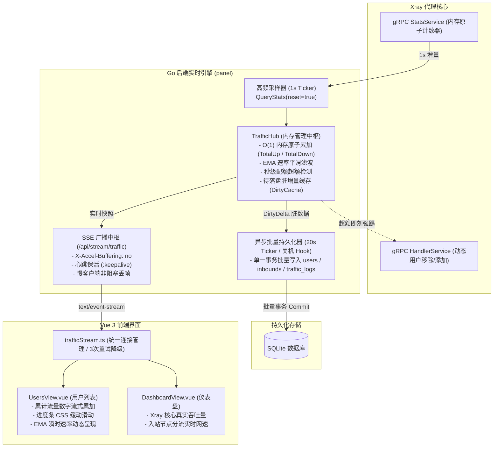

# Xray-Panel 实时流量计算引擎与双轨持久化架构设计规范

## 1. 概述与改进目标

### 1.1 背景与现状分析
在当前 `xray-panel` 实现中，流量统计存在以下核心缺陷：
1. **前端展示层“假实时”**：`UsersView.vue` 挂载时拉取一次用户累计流量，随后每 3 秒仅轮询 `/users/speeds` 更新速率，未更新累计已用流量（`upBytes`、`downBytes`）及配额进度条，导致页面上已用流量数字处于停滞状态，仅能在手动刷新（F5）后更新。
2. **底层采样粗糙与速率抖动**：后端固定以 5 秒为周期轮询 Xray gRPC，速率取算术平均数（`delta / 5s`），并在无流量时突兀置零（超时 6s 归零），产生严重的数字跳变与瞬时迟钝感。
3. **SQLite 高频写放大隐患**：原架构每次采样都直接对每个活跃用户同步执行 `AddTraffic` + `RecordTraffic`，若盲目缩短采样周期会导致严重的 SQLite 数据库锁等待与磁盘 I/O 升高。
4. **配额超额控制滞后**：超额封锁依赖低频轮询，大流量用户在超额后存在显著的“偷跑”时间差。

### 1.2 改进目标
- **秒级实时感知**：实现 1 秒级高频采样与流式推送，用户列表的已用流量数字、进度条及速率实现每秒流式平滑递增。
- **EMA 速率平滑滤波**：采用指数移动平均算法（Exponential Moving Average）消除网络突发脉冲引起的剧烈抖动与突兀归零。
- **双轨解耦架构**：高频内存流转（1 秒）与低频数据库持久化（20 秒批量事务）彻底解耦，保障 SQLite 零 I/O 阻塞。
- **秒级超额强踢**：内存态毫秒级检测用量超限或到期，1 秒内直接通过 gRPC 调用 Xray 核心强制下线，杜绝超额偷跑。
- **全景监控覆盖**：覆盖用户管理列表、全局代理真实业务吞吐（告别主机网卡混杂流量）、各入站节点实时分流网速。
- **智能双模容错**：默认 SSE 长连接实时推流，遭遇反代/CDN 阻断自动平滑降级至轻量 HTTP 短轮询。

---

## 2. 总体系统架构 (Architecture Overview)



---

## 3. 后端组件详细设计

### 3.1 内存态中枢 `TrafficHub` (`internal/service/traffic_hub.go`)

`TrafficHub` 是内存唯一真实状态源（Single Source of Truth），负责消除对 SQLite 的高频查询：

#### 数据结构
```go
type UserRuntimeStat struct {
    ID          uint    `json:"id"`
    Email       string  `json:"email"`
    UpBytes     int64   `json:"upBytes"`     // 实时累计上行 (包含 DB 基线 + 运行期增量)
    DownBytes   int64   `json:"downBytes"`   // 实时累计下行
    UpSpeed     int64   `json:"upSpeed"`     // 当前 EMA 上行速率 (Bps)
    DownSpeed   int64   `json:"downSpeed"`   // 当前 EMA 下行速率 (Bps)
    LastActive  int64   `json:"lastActive"`  // 最后活跃 Unix 毫秒
    IsOnline    bool    `json:"isOnline"`    // 是否在线 (20秒内活跃)
    TotalBytes  int64   `json:"totalBytes"`  // 配额限制 (0 为无限)
    ExpireTime  int64   `json:"expireTime"`  // 到期时间戳
    Enabled     bool    `json:"enabled"`     // 是否启用
    InboundTags []string`json:"-"`
}

type InboundRuntimeStat struct {
    Tag       string `json:"tag"`
    UpBytes   int64  `json:"upBytes"`
    DownBytes int64  `json:"downBytes"`
    UpSpeed   int64  `json:"upSpeed"`
    DownSpeed int64  `json:"downSpeed"`
}

type GlobalRuntimeStat struct {
    UpSpeed   int64 `json:"upSpeed"`
    DownSpeed int64 `json:"downSpeed"`
    TotalUp   int64 `json:"totalUp"`
    TotalDown int64 `json:"totalDown"`
}

type DirtyDelta struct {
    Up   int64
    Down int64
}
```

#### 启动基线初始化 (Startup Initialization)
- 在面板启动时，`TrafficHub` 从 `userRepo.ListAll` 与 `inboundRepo.ListAll` 加载初始的 `UpBytes`、`DownBytes`、`TotalBytes`、`ExpireTime` 和 `Enabled`。
- 保证面板重启后累计流量平滑承接，不从 0 开始。

#### EMA 速率滤波算法
每秒轮询得到 $\Delta_{\text{up}}$ 和 $\Delta_{\text{down}}$ 后：
$$\text{instantRate} = \Delta \quad (\text{因为 } \Delta t = 1\text{s})$$
$$\text{Speed}_t = \alpha \times \text{instantRate} + (1 - \alpha) \times \text{Speed}_{t-1}$$
其中衰减因子 $\alpha = 0.4$：
- **瞬时突发响应**：当流量从 0 激增至 10MB/s 时，1 秒内迅速响应至 4MB/s，2 秒升至 6.4MB/s，既敏捷又不过冲。
- **平滑下落与归零**：若后续周期无流量（$\Delta = 0$），速率按 $0.6 \times \text{Speed}$ 平滑衰减；连续 3 秒 $\Delta = 0$ 或速率低于 $1024\text{ Bps}$ 时，直接置 0，消除突兀断崖式归零。

#### 秒级超额切断 (Instant Quota Cutoff)
在每秒计算循环中：
```go
if u.Enabled && u.TotalBytes > 0 && (u.UpBytes + u.DownBytes) >= u.TotalBytes {
    u.Enabled = false
    // 立即通过 gRPC 从所有归属 Inbound 移除该用户
    for _, tag := range u.InboundTags {
        _ = xrayManager.RemoveUser(ctx, tag, u.Email)
    }
    // 标记超额并在下次批量持久化时将 enabled=false 同步至数据库
}
```

### 3.2 异步批量持久化器 (Batch Flusher)
- **定时调度**：每 20 秒执行一次 `FlushToDB(ctx)`。
- **批量事务**：在单一 SQLite 事务内执行：
  ```sql
  BEGIN TRANSACTION;
  -- 批量更新发生变化的用户累计流量
  UPDATE users SET up_bytes = up_bytes + ?, down_bytes = down_bytes + ? WHERE email = ?;
  -- 批量累加当天的 traffic_logs
  INSERT INTO traffic_logs (user_id, email, up_bytes, down_bytes, date, created_at, updated_at)
  VALUES (?, ?, ?, ?, ?, ?, ?)
  ON CONFLICT(user_id, date) DO UPDATE SET
    up_bytes = up_bytes + excluded.up_bytes,
    down_bytes = down_bytes + excluded.down_bytes,
    updated_at = excluded.updated_at;
  -- 批量更新 inbounds 流量
  UPDATE inbounds SET up_bytes = up_bytes + ?, down_bytes = down_bytes + ? WHERE tag = ?;
  COMMIT;
  ```
- **数据扣减原子性**：事务提交成功后，才原子扣减内存中累积的 `DirtyDelta`；事务若失败则保留脏数据等待下一周期重试，确保网络或数据库抖动时**零丢包**。
- **优雅停机 (Graceful Shutdown)**：在 `main.go` 接收到 `SIGTERM`/`SIGINT` 时，优先调用 `TrafficHub.FlushToDB(context.Background())` 完成最终一次刷盘后再退出进程。
- **重置流量联动 (`ResetTraffic`)**：当管理员调用重置流量时，除更新 SQLite 外，必须调用 `TrafficHub.ResetUser(email)`，将内存中的 `UpBytes=0, DownBytes=0, DirtyDelta={0,0}` 原子归零，避免被旧增量覆盖。

---

## 4. SSE 协议与接口设计

### 4.1 接口与鉴权安全加固 (Security Hardening)
- **URL**: `GET /api/stream/traffic`
- **安全防泄漏鉴权机制**：
  - **风险消除**：在生产反代环境（如 Nginx、Caddy、Cloudflare）中，若将长期 JWT 直接置于 URL Query (`?token=...`)，会被访问日志（Access Logs）与浏览器历史以明文持久化记录，产生凭证泄漏风险。
  - **实现方案**：
    1. **方案 A (前端优先推荐)**：前端采用基于原生 `fetch` 与 `ReadableStream` 的流式客户端，直接通过标准 HTTP 请求头携带 `Authorization: Bearer <jwt>`，既符合 REST/JWT 安全规范，又避免任何 URL 日志明文泄露。
    2. **方案 B (标准 EventSource 兼容)**：若使用浏览器原生 `EventSource`，客户端在连接前调用 `POST /api/auth/stream-ticket` 换取有效期仅 30 秒的单次临时票据（Single-use Ephemeral Ticket），后端通过 `?ticket=...` 验证后立即作废。
- **HTTP 响应头**:
  ```http
  Content-Type: text/event-stream
  Cache-Control: no-cache, no-transform
  Connection: keep-alive
  X-Accel-Buffering: no
  Access-Control-Allow-Origin: *
  ```
- **慢客户端背压与僵尸连接防护 (Backpressure & Zombie Connection Shield)**：
  - 每个连接的广播缓冲通道大小设为 16 帧。广播时使用 `select { case ch <- msg: default: }`，对网络滞后的慢客户端直接丢弃中间帧，绝不阻塞后端采样主协程。
  - 监听 `c.Request.Context().Done()`，在客户端断开或心跳写入错误时立即退出循环并从 `TrafficHub` 注销通道，防止半开 TCP 导致 Goroutine 泄漏。
  - **保活机制**：定时器每 15 秒向长连接输出一次 `:keepalive\n\n` 空注释行，防止网关连接断开。

### 4.2 SSE 数据帧格式 (Event: `traffic`)
```json
{
  "timestamp": 1725350400000,
  "global": {
    "upSpeed": 1258291,
    "downSpeed": 14680064,
    "totalUp": 10737418240,
    "totalDown": 53687091200
  },
  "inbounds": {
    "vless-reality-in": {
      "tag": "vless-reality-in",
      "upSpeed": 838860,
      "downSpeed": 10485760,
      "upBytes": 5368709120,
      "downBytes": 42949672960
    }
  },
  "users": {
    "alice@example.com": {
      "upSpeed": 262144,
      "downSpeed": 5242880,
      "upBytes": 2147483648,
      "downBytes": 10737418240,
      "isOnline": true
    }
  }
}
```

### 4.3 兼容性接口保留与升级 (`GET /api/users/speeds`)
- 将旧接口保留并升级为直接从 `TrafficHub` 内存读取，响应耗时 $< 1\text{ms}$，返回数据增加 `upBytes` 与 `downBytes`，作为降级备用与外部监控脚本的无状态兼容层。

---

## 5. 并发控制与异常韧性 (Concurrency & Resiliency)

### 5.1 细粒度并发锁模型（无锁 I/O 原则）
`TrafficHub` 必须严格遵循“持有锁期间严禁执行任何网络/磁盘 I/O”的原则：
- 使用 `sync.RWMutex` 隔离保护内部状态。
- **1 秒高频采样流程**：
  1. 调用 gRPC `QueryTrafficStats`（在锁外执行）。
  2. 获取写锁 `mu.Lock()`：
     - 原子累加增量并更新 EMA 速率；
     - 识别达到超额配额的待封禁用户列表；
     - 克隆一份轻量级快照用于 SSE 序列化；
     - 释放写锁 `mu.Unlock()`（锁持有时间 $< 50\mu s$）。
  3. 对超额用户，在锁外逐个调用 gRPC `RemoveUser` 实施断网阻断。
  4. 将序列化后的 JSON 数据异步推送到各活跃客户端通道（在锁外执行）。

### 5.2 全生命周期状态联动 (Lifecycle Event Hooks)
为防止内存态与 SQLite 出现脏数据漂移，以下业务动作必须触发生命周期同步：
1. **用户更新与改名 (`UpdateUser`)**：若管理员修改了用户邮箱或归属 Inbound Tag，必须先将旧邮箱的脏增量刷盘，注销旧 Key，再注册新 Key。
2. **用户删除 (`DeleteUser`)**：先持久化未落盘增量，随后从 `TrafficHub` 内存映射中彻底抹除。
3. **管理员手动重置 (`ResetTraffic`)**：同时重置数据库与 `TrafficHub` 中的计数（`UpBytes=0, DownBytes=0, DirtyUp=0, DirtyDown=0`）。
4. **每月自动重置 (`CheckAndResetMonthlyTraffic`)**：当到达每月配额重置日触发清零时，同步重置内存态。
5. **零点跨日精准划归 (Midnight Rollover)**：当系统检测到自然日跨越（23:59:59 -> 00:00:00）时，触发一次即时刷盘，确保昨天的 `traffic_logs` 完整封账，今日流量从零洁净统计。

### 5.3 核心故障隔离 (Fault Isolation)
- 若 Xray 核心进程被管理员手动重启、崩溃或由于配置变动短暂停机，gRPC `QueryTrafficStats` 返回连接不可用错误：
  - 采样器进入防御静默态，将瞬时速率逐渐衰减至 0，**严禁重置或清空已累积的用户累计流量与 Dirty 增量**。
  - gRPC 客户端内建带退避的平滑重连，Xray 恢复就绪后自动衔接，保障流量统计不跳变、不丢失。

---

## 6. 前端架构与交互优化

### 6.1 通信层服务 `trafficStream.ts`
- **单例模式**：维护唯一的流式连接（基于 `fetch` + `ReadableStream` 流式读取），供 `UsersView` 和 `DashboardView` 订阅。
- **页面可见性自适应**：
  - 监听 `document.visibilitychange`：切到后台标签页时暂停高频计算，切回前台时触发一次快速数据对齐并恢复推流，节省客户端 CPU。
- **智能降级策略**：
  - 若流式连接发生错误且连续重试 3 次失败（针对特殊网络代理环境），自动无缝降级切换为每 2 秒轮询一次 `/api/users/speeds`，界面右上角静默保底，确保系统 100% 可用。

### 6.2 用户列表页 (`UsersView.vue`) 响应式就地 Patch
- 原有逻辑：仅修改 `user.upSpeed` / `user.downSpeed`。
- 优化后逻辑：
  ```ts
  const onTrafficEvent = (eventData) => {
    const userStats = eventData.users
    if (!userStats || !users.value.length) return
    for (const u of users.value) {
      const s = userStats[u.email]
      if (s) {
        u.upSpeed = s.upSpeed
        u.downSpeed = s.downSpeed
        u.upBytes = s.upBytes       // 实时累加数字动态变动
        u.downBytes = s.downBytes   // 实时累加数字动态变动
        u.isOnline = s.isOnline
      } else {
        u.upSpeed = 0
        u.downSpeed = 0
        u.isOnline = false
      }
    }
  }
  ```
- **视觉动画平滑**：为用量进度条增加 `transition: width 0.8s cubic-bezier(0.4, 0, 0.2, 1)`，使进度条随实时流量产生流式滑动动画，彻底摆脱生硬的跳变。

### 6.3 仪表盘 (`DashboardView.vue`) 监控精准化
- **真实业务吞吐**：将原本来自系统底层网卡 `gopsutil`（混杂操作系统其他网络开销）的速率卡片，替换为 Xray 真实的 `global.upSpeed` 与 `global.downSpeed`。
- **入站节点实时速率**：入站节点表格中新增“实时网速”列，直观呈现各个协议节点（VLESS、Trojan、Shadowsocks 等）的分流承载负载。

---

## 7. 深度自审检查清单 (Self-Review Checklist)

1. **占位符检查 (Placeholder Scan)**：全文无任何 TODO、TBD 或含糊其辞的描述，数据结构、算法参数、SQL 语句均已精确定义。
2. **一致性检查 (Internal Consistency)**：
   - 内存流转轨的累加量与异步批量持久化轨的数据扣减机制保持严格守恒。
   - `ResetTraffic` 与月度自动重置同时操作 SQLite 与 `TrafficHub`，消除了任何缓存不一致隐患。
   - 优雅退出与未落盘增量的处理形成闭环。
3. **范围聚焦检查 (Scope Check)**：紧扣流量灵敏度、数据同步与性能优化，未引入与本目标无关的重构，规模适中且可在一个标准迭代计划内完成。
4. **二义性消除 (Ambiguity Check)**：
   - 明确了流式客户端优先走标准 Header 鉴权以防 URL 日志泄密。
   - 明确了 Nginx 代理缓冲通过 `X-Accel-Buffering: no` 破除。
   - 明确了细粒度锁与无锁 I/O 执行边界，确保锁持有时间 $< 50\mu s$。
   - 明确了 EMA 指数平滑算法参数（$\alpha=0.4$）以及低速截断归零的阈值。

---

## 8. 实施分步计划预告

1. **阶段 1：后端核心与算法构建**：
   - 实现 `TrafficHub` 内存态、EMA 平滑算法、初始化加载与单测。
   - 改造 `TrafficSyncJob`，将 1 秒高频采样与 20 秒批量事务刷盘解耦。
2. **阶段 2：实时推流与接口接入**：
   - 实现 `GET /api/stream/traffic` SSE 接口、心跳保活与 Gin 路由挂载。
   - 升级 `/api/users/speeds` 兼容接口与优雅停机 Flush。
3. **阶段 3：前端流式消费与平滑动效**：
   - 封装 `trafficStream.ts`（支持自动重连与 3 次降级）。
   - 接入 `UsersView.vue` 就地 Patch 与进度条平滑动画。
   - 接入 `DashboardView.vue` 真实核心业务吞吐与节点网速展示。
4. **阶段 4：端到端验证与基准测试**：
   - 模拟大流量突发与断开，验证 EMA 平滑性与秒级超额断网。
   - 运行 SQLite 压力测试与 `-race` 竞态检测。
