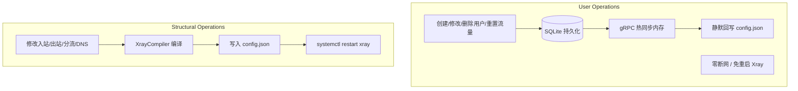

# Xray Decoupled Panel 全方位系统审查、功能性缺陷修复与架构加固设计规范

- **日期**：2026-09-03
- **版本**：v1.5.0-spec
- **目标**：彻底修复审查发现的核心功能性 Bug，严格兑现“零断网热重载”承诺，实现用户配额生命周期闭环与数据更新安全加固。

---

## 1. 背景与核心审查发现 (Review Findings)

本项目作为单机 Xray 运维解耦面板，核心定位是**高稳定性、低资源占用与零连接中断**。在代码审查与实际运行机制分析中，发现了 6 项关键功能性与架构缺陷：

1. **REALITY 回落目标前端与后端脱节 (Bug)**：
   前端与 Mock 沙盒使用 `realitySettings.target`，而后端编译器基于 Xray 官方规范使用 `dest`。反序列化后 `r.Dest` 始终为空，导致编译器强制重置为默认值 `www.titech.ac.jp:443`，用户自定义的 SNI/Dest 完全失效。
2. **用户配额与生命周期断环 (Bug)**：
   - `compiler.go` 编译配置时仅检查 `!u.Enabled`，未检查 `IsActive()`，超额与过期用户在配置重编译或面板重启后被重新编入 Xray 放行；
   - 5秒定时任务 `traffic_sync.go` 仅检查了 `IsTrafficExceeded()`，从未剔除到期用户；
   - 单用户/批量/月度流量重置后，仅修改了数据库，未通过 gRPC `AddUser` 恢复用户，导致用户被永久隔离在 Xray 内存外。
3. **用户操作全量重启引发网络中断 (Architecture Flaw)**：
   `UserService` 在用户增删改或批量操作时调用 `SyncUserToFile`，触发 `RecompileAndApply` -> `supervisor.Reload` -> `systemctl restart xray`。每次用户变动都全量重启内核，严重违背“热重载不影响现存连接”的承诺。
4. **Update 接口盲目覆盖导致流量计量数据丢失 (Bug)**：
   HTTP Update 接口直接将前端 JSON 写入领域模型并调用 `db.Save()`，将前端过时的 `up_bytes` 和 `down_bytes` 覆盖数据库正在累加的真实流量，造成计数回退甚至清零。
5. **多入站关联子串匹配误伤 (Bug)**：
   `ListByInboundTag` 使用 `LIKE %tag%`，导致 `vless-in` 误匹配 `vless-in-2` 等相似节点。
6. **静态硬编码 (Bug)**：
   - 编译器中 API Inbound 端口硬编码为 8080，忽略命令行启动参数 `-xray-grpc`；
   - gRPC 动态添加 Shadowsocks 用户时固定为 `AES_128_GCM`，忽略入站配置中实际指定的 Cipher。

---

## 2. 核心架构改进设计 (Architecture Design)

### 2.1 运行时内存操作与服务重载彻底解耦

区分两类系统事件：

1. **用户级轻量变更 (User Operations)**：
   - 范围：用户增删改、超额踢出、过期剔除、流量重置恢复、批量延期。
   - 处理流程：
     1. 执行数据库持久化（带 DTO 保护）；
     2. 仅调用 gRPC API 对 Xray 内存进行增删（`AddUser` / `RemoveUser`）；
     3. **静默持久化**：调用 `SaveConfigQuietly(ctx)` 将最新配置写入物理磁盘文件（供将来重启读取），**严禁调用 `supervisor.Reload` 或 `systemctl restart`**。
   - 结果：现存用户 TCP/UDP 连接零断开，毫秒级生效。

2. **拓扑级结构变更 (Structural Operations)**：
   - 范围：增删改入站（Inbound）、出站（Outbound）、分流规则（Routing）、DNS 配置。
   - 处理流程：
     1. 单向强类型编译根配置；
     2. 语法校验与落盘；
     3. 调用 `supervisor.Restart`（或 Reload）平滑重启内核。



---

### 2.2 用户生命周期全防线闭环设计

系统建立三道立体防线，确保用户在任何场景下均具备强一致的访问控制：

1. **防线一：静态编译时过滤（Compiler Gate）**
   在 `XrayCompiler.compileInbound` 中，替换 `if !u.Enabled` 为：
   ```go
   if !u.IsActive() {
       continue
   }
   ```
   只要用户禁用、流量超额或时间过期，均不会被编译入 Xray 配置文件，杜绝重启后死灰复燃。

2. **防线二：运行时动态探测与剔除（Runtime Sync Eviction）**
   在 `traffic_sync.go` 定时轮询中，完善用户剔除条件：
   ```go
   if !user.IsActive() { // 包含 IsTrafficExceeded() || IsExpired() || !Enabled
       for _, t := range user.GetInboundTagList() {
           _ = j.xrayManager.RemoveUser(ctx, t, user.Email)
       }
   }
   ```

3. **防线三：重置与续期自动恢复（Lifecycle Auto-Restore）**
   在 `ResetTraffic`、`BatchResetTraffic`、`BatchRenew` 以及每月定时重置任务中：
   在数据库流量清零或时间延期后，立即检查 `user.IsActive()`：
   若状态有效，则对用户拥有的所有 `GetInboundTagList()` 触发 `xrayManager.AddUser(ctx, tag, user)`，自动将其加回 Xray 内存，并触发静默落盘。

---

### 2.3 数据持久化安全与 DTO 隔离

1. **UpdateUserDTO 设计**：
   ```go
   type UpdateUserDTO struct {
       InboundTags []string `json:"inboundTags"`
       InboundTag  string   `json:"inboundTag"`
       Flow        string   `json:"flow"`
       TotalBytes  int64    `json:"totalBytes"`
       ExpireTime  int64    `json:"expireTime"`
       ResetDay    int      `json:"resetDay"`
       IPLimit     int      `json:"ipLimit"`
       Enabled     *bool    `json:"enabled"`
   }
   ```
   禁止前端修改或传入 `up_bytes`、`down_bytes`、`uuid`、`sub_token`。

2. **仓储层非覆盖性更新**：
   在 `user_repo.go` 中，更新方法仅修改业务指定字段，或使用 GORM 的 `Select(...)` / `Updates(...)`，绝不覆写计量数据。

3. **入站标签精确比对**：
   在 `user_repo.go` 的 `ListByInboundTag` 中，废除直接子串模糊匹配，改用首选严格包含判断（或加载所有有效用户并在 Go 内存中通过 `u.HasInbound(tag)` 精确比对），杜绝误伤。

---

### 2.4 协议参数对齐与动态端口绑定

1. **REALITY dest 规范化**：
   - `web/src/views/InboundsView.vue` 表单提交与回显使用 `dest` 属性（兼容历史 `target` 属性）。
   - `web/src/mock/storage.ts` 默认数据改为 `dest: 'www.titech.ac.jp:443'`。
   - 后端 `compiler.go` 中若 `r.Dest == ""` 且 `r.Target != ""` 时进行合流归一化，确保用户填写的外部回落目标 100% 真实编译进 `config.json`。

2. **动态 API Inbound 端口**：
   - `XrayCompiler` 增加 `grpcPort int` 成员变量。在启动阶段由 `cfg.XrayGRPCAddr` 解析出端口（如 `127.0.0.1:8080` 提取 `8080`），并注入编译器；
   - 编译 API Inbound 时使用动态端口，而非硬编码的 8080。

3. **Shadowsocks Cipher 动态匹配**：
   - `buildAccountMessage` 解析入站的 `settingsJson`，读取 `method` 或 `cipher`，动态设置 proto 中的 `CipherType`，默认回退至 `AES_128_GCM`。

---

## 3. 测试与验证策略 (Verification Strategy)

加固完成后，新增与执行以下单元测试套件：
1. `compiler_test.go`：
   - 测试超额用户与过期用户不会被编入 Inbound clients；
   - 测试自定义 gRPC 端口被正确编译至 `api` Inbound；
   - 测试 REALITY `dest` 字段正确映射与双向兼容。
2. `user_service_test.go`：
   - 测试更新用户时真实 `UpBytes`/`DownBytes` 不受影响；
   - 测试流量重置与到期续费后，用户被正确触发 `AddUser` 恢复；
   - 测试静默持久化不会调用 `supervisor.Reload`。
3. `user_repo_test.go`：
   - 测试 `ListByInboundTag` 精确匹配，确认 `vless-in` 不会误匹配 `vless-in-2`。
4. 全量回归测试：
   - 运行 `mise exec -- go test -v ./...`，确保所有包 100% 通过。
